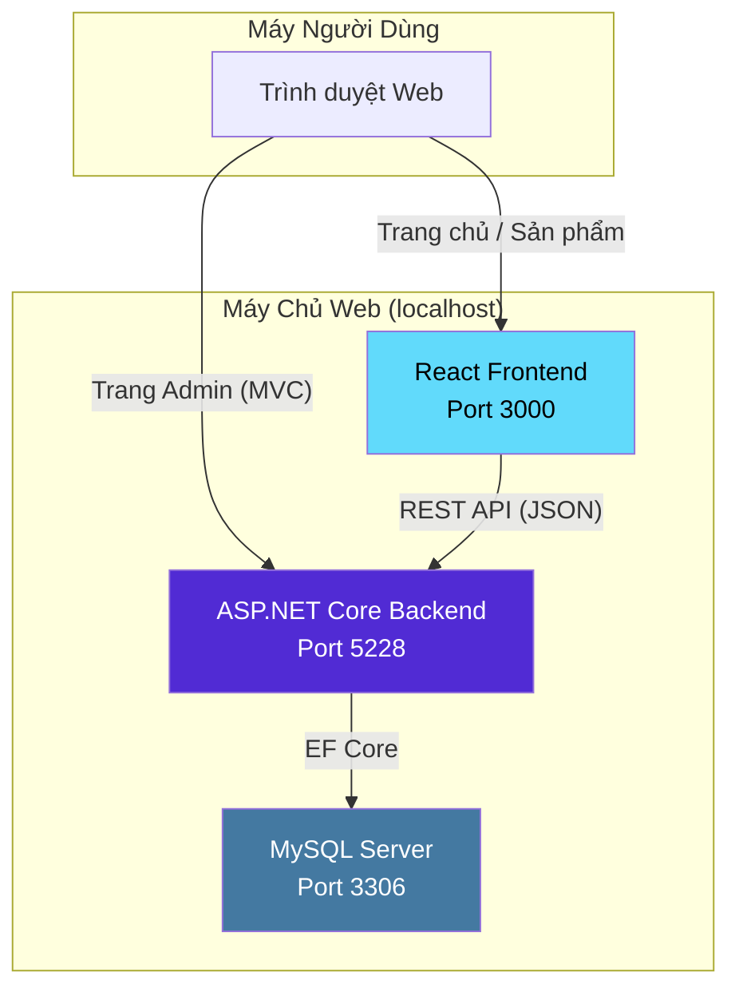
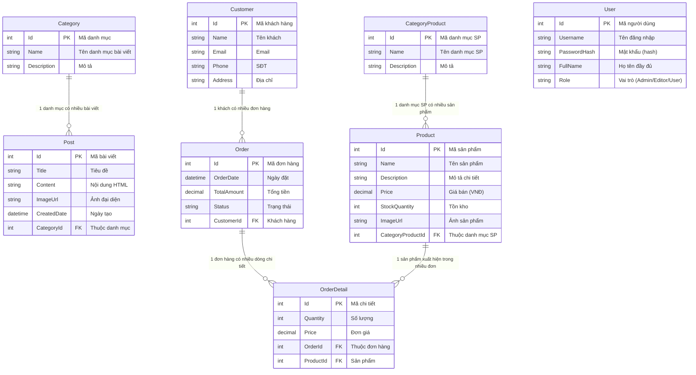
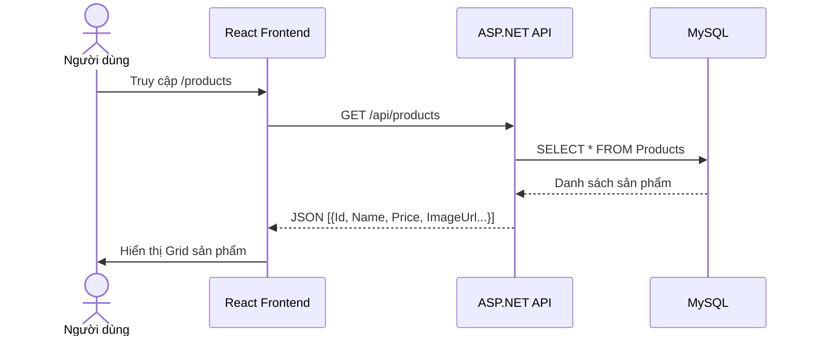
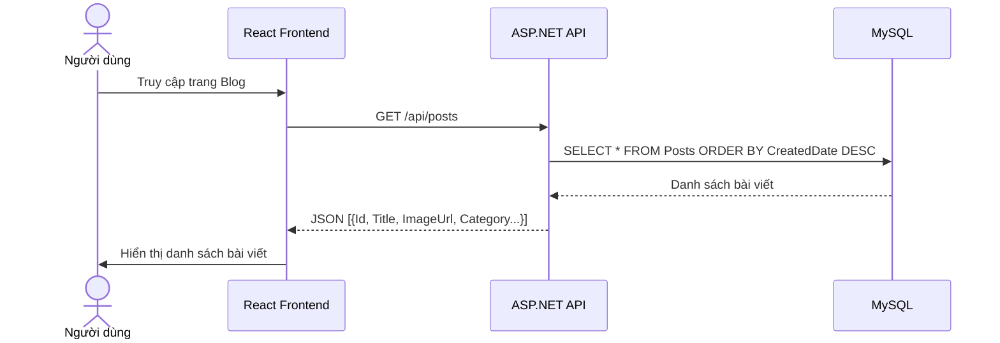
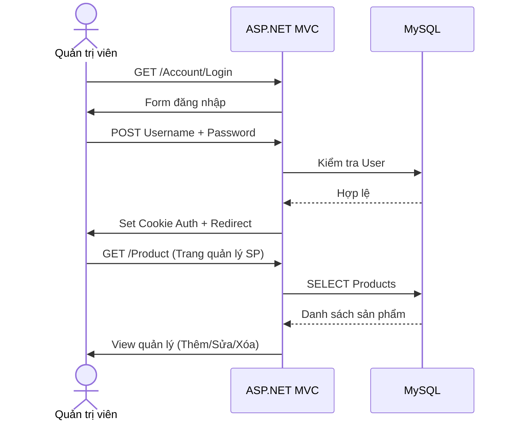

# 🎮 Kiến Trúc Hệ Thống — Website Đồ Công Nghệ & Gaming Gear

> **Sinh viên:** Phùng Đàm Duy Bảo — MSSV: 2123110487  
> **Công nghệ:** ASP.NET Core 8.0 + React 19 + MySQL  
> **Ngày cập nhật:** 22/06/2026

---

## 📋 Mục Lục

1. [Tổng Quan Dự Án](#1-tổng-quan-dự-án)
2. [Kiến Trúc Tổng Thể](#2-kiến-trúc-tổng-thể)
3. [Sơ Đồ Triển Khai](#3-sơ-đồ-triển-khai)
4. [Thiết Kế Cơ Sở Dữ Liệu](#4-thiết-kế-cơ-sở-dữ-liệu)
5. [Phân Hệ Backend — ASP.NET Core](#5-phân-hệ-backend--aspnet-core)
6. [Phân Hệ Frontend — React SPA](#6-phân-hệ-frontend--react-spa)
7. [Luồng Xử Lý Chính](#7-luồng-xử-lý-chính)
8. [Tính Năng & Phân Quyền](#8-tính-năng--phân-quyền)
9. [Công Nghệ Sử Dụng](#9-công-nghệ-sử-dụng)

---

## 1. Tổng Quan Dự Án

### 1.1 Mô tả

Website thương mại điện tử chuyên bán **đồ công nghệ & gaming gear**:

| Danh mục sản phẩm | Ví dụ                                                 |
| ----------------- | ----------------------------------------------------- |
| 🖱️ Chuột gaming   | Logitech G502, Razer DeathAdder, Corsair Harpoon      |
| ⌨️ Bàn phím cơ    | Akko 3068B, Keychron K2, Ducky One 3                  |
| 🎧 Tai nghe       | HyperX Cloud II, SteelSeries Arctis, Razer BlackShark |
| 🪫 Lót chuột LED  | Razer Goliathus, Corsair MM700 RGB                    |

### 1.2 Phân hệ CMS (Quản trị nội dung)

Hệ thống **Post/Bài viết** cung cấp nội dung chuyên sâu:

- 📝 Hướng dẫn custom bàn phím cơ cho người mới
- 🏆 Top chuột gaming dưới 1 triệu đồng
- 🎧 Review tai nghe gaming budget
- 🛠️ Mẹo bảo trì, vệ sinh gear gaming

---

## 2. Kiến Trúc Tổng Thể

Dự án áp dụng kiến trúc **3 tầng (3-Tier Architecture)** kết hợp mô hình **SPA (Single Page Application)**:

```
┌─────────────────────────────────────────────────────────────────┐
│                     TRÌNH DUYỆT NGƯỜI DÙNG                       │
│                   (Chrome / Firefox / Edge)                      │
└────────────────────────┬────────────────────────────────────────┘
                         │  HTTP / HTTPS
                         ▼
┌─────────────────────────────────────────────────────────────────┐
│               TẦNG TRÌNH DIỄN (PRESENTATION TIER)                │
│                                                                   │
│   ┌─────────────────────┐    ┌──────────────────────────────┐    │
│   │  React SPA (Port 3000)│    │  ASP.NET MVC Views (Razor)  │    │
│   │  • Trang chủ         │    │  • Admin Dashboard           │    │
│   │  • Danh sách sản phẩm│    │  • Quản lý Post             │    │
│   │  • Chi tiết sản phẩm │    │  • Quản lý Product          │    │
│   │  • Bài viết / Blog   │    │  • Quản lý Category          │    │
│   └──────────┬──────────┘    └──────────────┬───────────────┘    │
│              │                              │                     │
└──────────────┼──────────────────────────────┼─────────────────────┘
               │  REST API (JSON)             │  MVC Request/Response
               ▼                              ▼
┌─────────────────────────────────────────────────────────────────┐
│            TẦNG ỨNG DỤNG (APPLICATION TIER)                      │
│                    ASP.NET Core 8.0                               │
│                                                                   │
│   ┌──────────────────────────────────────────────────────────┐   │
│   │                    MIDDLEWARE PIPELINE                     │   │
│   │  HTTPS → StaticFiles → Routing → CORS → Auth → MVC/API   │   │
│   └──────────────────────────────────────────────────────────┘   │
│                                                                   │
│   ┌─────────────────┐  ┌─────────────────┐  ┌────────────────┐   │
│   │  API Controllers │  │  MVC Controllers│  │  Swagger UI    │   │
│   │  (REST JSON)     │  │  (Razor Views)  │  │  /swagger      │   │
│   │                  │  │                 │  │                │   │
│   │  ProductsController│ │ ProductController│ │  Tài liệu API  │   │
│   │  PostsController │  │  PostController │  │                │   │
│   │  CategoriesProducts│ │  CategoryController│ │            │   │
│   └────────┬─────────┘  └────────┬────────┘  └────────────────┘   │
│            │                     │                                 │
└────────────┼─────────────────────┼────────────────────────────────┘
             │                     │
             ▼                     ▼
┌─────────────────────────────────────────────────────────────────┐
│                TẦNG DỮ LIỆU (DATA TIER)                          │
│                                                                   │
│   ┌──────────────────────────────────────────────────────────┐   │
│   │              Entity Framework Core 8.0                    │   │
│   │                                                           │   │
│   │  ApplicationDbContext                                     │   │
│   │  ├── DbSet<Category>           (Danh mục bài viết)        │   │
│   │  ├── DbSet<Post>               (Bài viết / Blog)         │   │
│   │  ├── DbSet<User>               (Người dùng hệ thống)     │   │
│   │  ├── DbSet<CategoryProduct>    (Danh mục sản phẩm)       │   │
│   │  ├── DbSet<Product>            (Sản phẩm gaming gear)    │   │
│   │  ├── DbSet<Customer>           (Khách hàng)              │   │
│   │  ├── DbSet<Order>              (Đơn hàng)                │   │
│   │  └── DbSet<OrderDetail>        (Chi tiết đơn hàng)       │   │
│   └──────────────────────────┬───────────────────────────────┘   │
│                              │                                    │
│                              ▼                                    │
│                   ┌──────────────────┐                            │
│                   │   MySQL Database │                            │
│                   └──────────────────┘                            │
└─────────────────────────────────────────────────────────────────┘
```

---

## 3. Sơ Đồ Triển Khai



---

## 4. Thiết Kế Cơ Sở Dữ Liệu

### 4.1 Sơ Đồ Quan Hệ (ERD)



### 4.2 Dữ Liệu Mẫu Cho Gaming Gear

#### Danh mục sản phẩm (CategoryProduct)

| Id  | Name               | Description                                   |
| --- | ------------------ | --------------------------------------------- |
| 1   | 🖱️ Chuột Gaming    | Chuột chơi game chuyên dụng, cảm biến cao cấp |
| 2   | ⌨️ Bàn Phím Cơ     | Bàn phím cơ switch hotswap, custom keycap     |
| 3   | 🎧 Tai Nghe Gaming | Tai nghe 7.1 surround, noise-cancelling       |
| 4   | 🪫 Lót Chuột LED   | Mousepad RGB kích thước lớn, chống trượt      |

#### Danh mục bài viết (Category)

| Id  | Name                 | Description                                   |
| --- | -------------------- | --------------------------------------------- |
| 1   | 🛠️ Hướng Dẫn Custom  | Hướng dẫn mod, build bàn phím cơ, thay switch |
| 2   | 🏆 Top List & Review | Bảng xếp hạng, đánh giá sản phẩm gaming       |
| 3   | 📰 Tin Công Nghệ     | Tin tức mới nhất về gaming gear               |
| 4   | 💡 Mẹo & Thủ Thuật   | Mẹo tối ưu setup gaming, bảo trì thiết bị     |

---

## 5. Phân Hệ Backend — ASP.NET Core

### 5.1 Cấu Trúc Thư Mục

```
duybao.Backend/
├── Program.cs                     # Entry point: DI, Middleware, Routing
├── appsettings.json               # Connection string MySQL
├── Controllers/
│   ├── HomeController.cs          # MVC: Trang chủ, hiển thị bài viết mới
│   ├── AccountController.cs       # MVC: Đăng nhập / Phân quyền
│   │
│   ├── ProductsController.cs      # API: CRUD sản phẩm (REST JSON)
│   ├── PostsController.cs         # API: CRUD bài viết (REST JSON)
│   ├── CategoriesProductsController.cs  # API: Danh mục sản phẩm
│   │
│   ├── ProductController.cs       # MVC: Quản lý sản phẩm (Admin)
│   ├── PostController.cs          # MVC: Quản lý bài viết (Admin)
│   ├── CategoryController.cs      # MVC: Quản lý danh mục bài viết
│   ├── ProductCategoryController.cs  # MVC: Quản lý danh mục SP
│   ├── UserController.cs          # MVC: Quản lý người dùng
│   └── OrdersController.cs        # MVC: Quản lý đơn hàng
├── Models/
│   └── ErrorViewModel.cs          # Model cho trang lỗi
├── Views/                         # Razor Views (Admin Dashboard)
│   ├── Shared/
│   │   ├── _Layout.cshtml         # Layout chính
│   │   └── _LayoutAdmin.cshtml    # Layout Admin
│   ├── Home/                      # Trang chủ
│   ├── Product/                   # CRUD sản phẩm
│   ├── Post/                      # CRUD bài viết
│   ├── Category/                  # CRUD danh mục bài viết
│   └── ...
└── wwwroot/                       # File tĩnh (CSS, JS, uploads)
```

### 5.2 Middleware Pipeline (Thứ Tự Xử Lý)

```
Request → HTTPS Redirect → Static Files → Routing → CORS → Auth → MVC/API → Response
```

| Middleware                 | Vai trò                                 |
| -------------------------- | --------------------------------------- |
| `UseHttpsRedirection`      | Ép buộc dùng HTTPS                      |
| `UseStaticFiles`           | Phục vụ file tĩnh (css, js, ảnh upload) |
| `UseRouting`               | Phân tích URL, xác định Endpoint        |
| `UseCors("AllowReactApp")` | Cho phép React gọi API khác port        |
| `UseAuthentication`        | Xác thực Cookie                         |
| `UseAuthorization`         | Phân quyền truy cập                     |

### 5.3 Cơ Chế Xác Thực & Phân Quyền

```
┌──────────────────────────────────────────────────────────────┐
│                     PHÂN QUYỀN 3 CẤP                          │
│                                                               │
│  ┌─────────┐  ┌──────────┐  ┌──────────┐                     │
│  │  Admin   │  │  Editor  │  │   User   │                     │
│  │  Toàn    │  │ Quản lý  │  │ Xem SP   │                     │
│  │  quyền  │  │ bài viết │  │ & Blog   │                     │
│  └─────────┘  └──────────┘  └──────────┘                     │
│                                                               │
│  • Cookie Authentication                                     │
│  • Login: /Account/Login                                     │
│  • [Authorize] trên Controller Admin                        │
│  • API Public: GET sản phẩm, GET bài viết (không cần login) │
└──────────────────────────────────────────────────────────────┘
```

### 5.4 API Endpoints (REST)

| Method   | Endpoint                  | Mô tả                            | Auth  |
| -------- | ------------------------- | -------------------------------- | ----- |
| `GET`    | `/api/products`           | Lấy toàn bộ sản phẩm gaming gear | Không |
| `GET`    | `/api/products/{id}`      | Lấy chi tiết 1 sản phẩm          | Không |
| `POST`   | `/api/products`           | Tạo sản phẩm mới                 | Admin |
| `PUT`    | `/api/products/{id}`      | Cập nhật sản phẩm                | Admin |
| `DELETE` | `/api/products/{id}`      | Xóa sản phẩm                     | Admin |
| `GET`    | `/api/posts`              | Lấy toàn bộ bài viết blog        | Không |
| `GET`    | `/api/posts/{id}`         | Lấy chi tiết bài viết            | Không |
| `GET`    | `/api/categoriesproducts` | Lấy danh mục sản phẩm            | Không |

---

## 6. Phân Hệ Frontend — React SPA

### 6.1 Cấu Trúc Thư Mục

```
duybao.frontend/src/
├── App.js                          # Router chính, layout chung
├── index.js                        # Entry point React
├── api/
│   └── axiosClient.js              # Cấu hình Axios (baseURL, interceptor)
├── services/
│   ├── productService.js           # Gọi API sản phẩm
│   ├── blogService.js              # Gọi API bài viết
│   └── categoryProductService.js   # Gọi API danh mục SP
├── pages/
│   ├── HomePage.jsx                # Trang chủ: banner, SP nổi bật, blog mới
│   └── ProductsPage.jsx            # Trang danh sách sản phẩm
├── components/
│   ├── TopBar.jsx                  # Thanh trên cùng (hotline, hỗ trợ)
│   ├── NavBar.jsx                  # Menu điều hướng + Logo + Search
│   ├── BannerSection.jsx           # Banner khuyến mãi
│   ├── ProductList.jsx             # Grid hiển thị sản phẩm
│   ├── CategoryProductList.jsx     # Filter danh mục sản phẩm
│   ├── PostList.jsx                # Grid hiển thị bài viết blog
│   ├── BlogCategoryList.jsx        # Filter danh mục bài viết
│   └── FooterSection.jsx           # Footer thông tin
└── App.css                         # Style chính
```

### 6.2 Luồng Dữ Liệu Frontend → Backend

```
Component (JSX) → Service (Axios) → axiosClient → HTTP Request
                                                      │
                                                      ▼
                                              ASP.NET Core API
                                              (Port 5228)
                                                      │
                                                      ▼
                                              Entity Framework → MySQL
                                                      │
                                                      ▼
                                              JSON Response
                                                      │
                                                      ▼
Component ← Service ← axiosClient ← HTTP Response (JSON)
```

### 6.3 Các Trang Chính

| Trang         | Route           | Component       | Chức năng                             |
| ------------- | --------------- | --------------- | ------------------------------------- |
| Trang chủ     | `/`             | `HomePage`      | Banner, SP nổi bật, bài viết mới nhất |
| Sản phẩm      | `/products`     | `ProductsPage`  | Danh sách SP, filter theo danh mục    |
| Chi tiết SP   | `/products/:id` | `ProductDetail` | Ảnh, mô tả, giá, nút mua              |
| Bài viết      | `/blog`         | `BlogPage`      | Danh sách bài viết gaming             |
| Chi tiết blog | `/blog/:id`     | `BlogDetail`    | Nội dung hướng dẫn, review            |

---

## 7. Luồng Xử Lý Chính

### 7.1 Luồng Xem Sản Phẩm



### 7.2 Luồng Đọc Bài Viết Blog



### 7.3 Luồng Quản Trị (Admin)



---

## 8. Tính Năng & Phân Quyền

### 8.1 Ma Trận Chức Năng

| Chức năng               | Khách (Public) | User | Editor | Admin |
| ----------------------- | :------------: | :--: | :----: | :---: |
| Xem sản phẩm            |       ✅       |  ✅  |   ✅   |  ✅   |
| Xem bài viết blog       |       ✅       |  ✅  |   ✅   |  ✅   |
| Tìm kiếm sản phẩm       |       ✅       |  ✅  |   ✅   |  ✅   |
| Đăng ký tài khoản       |       ✅       |  —   |   —    |   —   |
| Đặt hàng                |       —        |  ✅  |   ✅   |  ✅   |
| Quản lý bài viết (Post) |       —        |  —   |   ✅   |  ✅   |
| Quản lý sản phẩm        |       —        |  —   |   —    |  ✅   |
| Quản lý danh mục        |       —        |  —   |   —    |  ✅   |
| Quản lý người dùng      |       —        |  —   |   —    |  ✅   |
| Xem đơn hàng            |       —        |  —   |   —    |  ✅   |

### 8.2 Danh Sách Tính Năng Đầy Đủ

**A. Phía Người Dùng (Public + Khách Hàng)**

- [x] Trang chủ với banner khuyến mãi
- [x] Danh sách sản phẩm theo danh mục (chuột, bàn phím, tai nghe, lót chuột)
- [x] Lọc sản phẩm theo danh mục
- [x] Đọc bài viết hướng dẫn, review gaming gear
- [x] Tìm kiếm sản phẩm
- [ ] Giỏ hàng & Đặt hàng (đã có Entity, đang phát triển)

**B. Phía Admin (Quản trị)**

- [x] Đăng nhập / Phân quyền Cookie
- [x] CRUD Sản phẩm (Thêm, Sửa, Xóa sản phẩm)
- [x] CRUD Bài viết (Viết bài hướng dẫn, review)
- [x] CRUD Danh mục sản phẩm
- [x] CRUD Danh mục bài viết
- [x] Quản lý người dùng
- [x] Swagger UI tài liệu API

---

## 9. Công Nghệ Sử Dụng

| Tầng                  | Công nghệ                | Version |
| --------------------- | ------------------------ | ------- |
| **Backend Framework** | ASP.NET Core             | 8.0     |
| **ORM**               | Entity Framework Core    | 8.0     |
| **Database**          | MySQL (Pomelo Provider)  | 8.0+    |
| **Auth**              | Cookie Authentication    | —       |
| **API Docs**          | Swagger / Swashbuckle    | 10.2.1  |
| **Frontend**          | React (Create React App) | 19.2    |
| **Routing**           | React Router DOM         | 7.18    |
| **HTTP Client**       | Axios                    | 1.17    |
| **CSS**               | Custom CSS + Bootstrap   | 5.x     |
| **Ngôn ngữ Backend**  | C# 12                    | —       |
| **Ngôn ngữ Frontend** | JavaScript (JSX)         | ES6+    |

---

## 📌 Tổng Kết

Hệ thống **Website Đồ Công Nghệ & Gaming Gear** được thiết kế theo mô hình:

- **Backend vững chắc**: ASP.NET Core 8.0 với kiến trúc phân tầng rõ ràng, dễ bảo trì và mở rộng.
- **Frontend hiện đại**: React SPA cho trải nghiệm người dùng mượt mà, không reload trang.
- **CMS đầy đủ**: Admin có thể tự quản lý sản phẩm và viết bài blog hướng dẫn (custom bàn phím cơ, top chuột gaming...) mà không cần can thiệp code.
- **Database chuẩn hóa**: MySQL với quan hệ rõ ràng giữa Product, Order, Customer, Post.
- **API RESTful chuẩn**: Dễ dàng tích hợp mobile app hoặc bên thứ 3 trong tương lai.

> _"Đơn giản nhưng đầy đủ chức năng — Đúng tinh thần của một hệ thống thương mại điện tử gaming gear."_
