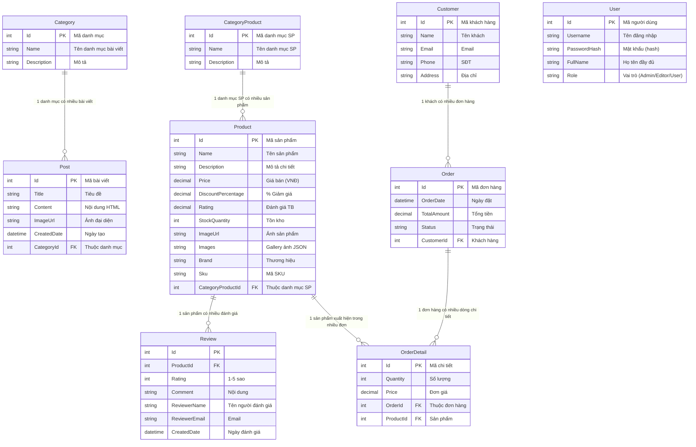

# 📘 BÁO CÁO CHUYÊN ĐỀ THỰC TẬP

> **Trường:** Cao Đẳng Công Thương TP. HCM  
> **Khoa:** Công Nghệ Thông Tin  
> **Đề tài:** XÂY DỰNG WEBSITE THƯƠNG MẠI ĐIỆN TỬ ĐỒ CÔNG NGHỆ & GAMING GEAR KẾT HỢP HỆ THỐNG CMS BLOG  
> **GVHD:** Nguyễn Văn A  
> **SVTH:** Phùng Đàm Duy Bảo  
> **MSSV:** 2123110487  
> **TPHCM, tháng 07 năm 2026**

---

## LỜI CẢM ƠN

Em xin chân thành cảm ơn quý thầy cô Khoa Công Nghệ Thông Tin, Trường Cao Đẳng Công Thương TP. HCM đã tận tình giảng dạy và truyền đạt kiến thức trong suốt thời gian học tập. Đặc biệt, em xin gửi lời cảm ơn sâu sắc đến thầy Nguyễn Văn A đã trực tiếp hướng dẫn, góp ý và hỗ trợ em hoàn thành đề tài này.

Trong quá trình thực hiện, em đã vận dụng các kiến thức về ASP.NET Core, ReactJS, Entity Framework Core và SQL Server để xây dựng một hệ thống website thương mại điện tử hoàn chỉnh. Mặc dù còn nhiều hạn chế, nhưng đây là sản phẩm tâm huyết đánh dấu sự trưởng thành của em trong lĩnh vực phát triển phần mềm.

---

## MỤC LỤC

1. [LỜI NHẬN XÉT](#lời-nhận-xét)
2. [LỜI CẢM ƠN](#lời-cảm-ơn)
3. [DANH MỤC CÁC KÝ HIỆU VÀ CHỮ VIẾT TẮT](#danh-mục-các-ký-hiệu-và-chữ-viết-tắt)
4. [DANH MỤC CÁC BẢNG](#danh-mục-các-bảng)
5. [DANH MỤC CÁC HÌNH VẼ, ĐỒ THỊ](#danh-mục-các-hình-vẽ-đồ-thị)
6. [MỞ ĐẦU](#mở-đầu)
7. [Chương 1: TỔNG QUAN VỀ ĐỀ TÀI](#chương-1-tổng-quan-về-đề-tài)
8. [Chương 2: CƠ SỞ LÝ THUYẾT](#chương-2-cơ-sở-lý-thuyết)
9. [Chương 3: PHÂN TÍCH VÀ THIẾT KẾ HỆ THỐNG](#chương-3-phân-tích-và-thiết-kế-hệ-thống)
10. [Chương 4: TRIỂN KHAI BACKEND — ASP.NET CORE](#chương-4-triển-khai-backend--aspnet-core)
11. [Chương 5: TRIỂN KHAI FRONTEND — REACTJS](#chương-5-triển-khai-frontend--reactjs)
12. [Chương 6: KẾT LUẬN VÀ HƯỚNG PHÁT TRIỂN](#chương-6-kết-luận-và-hướng-phát-triển)
13. [TÀI LIỆU THAM KHẢO](#tài-liệu-tham-khảo)

---

## DANH MỤC CÁC KÝ HIỆU VÀ CHỮ VIẾT TẮT

| Ký hiệu     | Ý nghĩa                           |
| ----------- | --------------------------------- |
| **API**     | Application Programming Interface |
| **ASP.NET** | Active Server Pages .NET          |
| **CMS**     | Content Management System         |
| **CORS**    | Cross-Origin Resource Sharing     |
| **CRUD**    | Create, Read, Update, Delete      |
| **CSS**     | Cascading Style Sheets            |
| **EF Core** | Entity Framework Core             |
| **ERD**     | Entity Relationship Diagram       |
| **HTML**    | HyperText Markup Language         |
| **HTTP**    | HyperText Transfer Protocol       |
| **JSON**    | JavaScript Object Notation        |
| **MVC**     | Model-View-Controller             |
| **REST**    | Representational State Transfer   |
| **SPA**     | Single Page Application           |
| **SQL**     | Structured Query Language         |
| **UI**      | User Interface                    |
| **URL**     | Uniform Resource Locator          |

---

## DANH MỤC CÁC BẢNG

| Bảng      | Tên bảng                            | Trang |
| --------- | ----------------------------------- | ----- |
| Bảng 1.1  | Mục tiêu kinh doanh                 |       |
| Bảng 1.2  | Mục tiêu kỹ thuật                   |       |
| Bảng 2.1  | So sánh công nghệ Backend           |       |
| Bảng 2.2  | So sánh công nghệ Frontend          |       |
| Bảng 3.1  | Danh sách 8 thực thể (Entity)       |       |
| Bảng 3.2  | Chi tiết bảng Category              |       |
| Bảng 3.3  | Chi tiết bảng Post                  |       |
| Bảng 3.4  | Chi tiết bảng CategoryProduct       |       |
| Bảng 3.5  | Chi tiết bảng Product               |       |
| Bảng 3.6  | Chi tiết bảng Review                |       |
| Bảng 3.7  | Chi tiết bảng User                  |       |
| Bảng 3.8  | Chi tiết bảng Customer              |       |
| Bảng 3.9  | Chi tiết bảng Order                 |       |
| Bảng 3.10 | Chi tiết bảng OrderDetail           |       |
| Bảng 4.1  | Danh sách Web API Endpoints         |       |
| Bảng 4.2  | Danh sách MVC Controllers           |       |
| Bảng 5.1  | Danh sách màn hình Frontend ReactJS |       |
| Bảng 5.2  | Danh sách Components                |       |

---

## DANH MỤC CÁC HÌNH VẼ, ĐỒ THỊ

| Hình     | Tên hình                                     | Trang |
| -------- | -------------------------------------------- | ----- |
| Hình 3.1 | Sơ đồ kiến trúc 3 tầng (3-Tier Architecture) |       |
| Hình 3.2 | Sơ đồ quan hệ giữa các bảng (ERD)            |       |
| Hình 3.3 | Sơ đồ triển khai hệ thống                    |       |
| Hình 3.4 | Middleware Pipeline                          |       |
| Hình 4.1 | Giao diện Swagger API                        |       |
| Hình 4.2 | Kết quả kiểm thử Postman - GET Products      |       |
| Hình 4.3 | Kết quả kiểm thử Postman - POST Order        |       |
| Hình 4.4 | Giao diện đăng nhập Admin                    |       |
| Hình 4.5 | Giao diện quản lý Product (CRUD)             |       |
| Hình 4.6 | Giao diện quản lý Post với CKEditor          |       |
| Hình 5.1 | Giao diện Trang chủ (HomePage)               |       |
| Hình 5.2 | Giao diện Danh sách sản phẩm (Shop)          |       |
| Hình 5.3 | Giao diện Chi tiết sản phẩm                  |       |
| Hình 5.4 | Giao diện Giỏ hàng (Cart)                    |       |
| Hình 5.5 | Giao diện Thanh toán (Checkout)              |       |
| Hình 5.6 | Giao diện Blog / Bài viết                    |       |
| Hình 5.7 | Giao diện Tìm kiếm sản phẩm                  |       |

---

## MỞ ĐẦU

### Lý do chọn đề tài

Trong thời đại công nghệ số, thương mại điện tử đã trở thành xu hướng mua sắm chủ đạo. Đặc biệt, thị trường đồ công nghệ và gaming gear (chuột gaming, bàn phím cơ, tai nghe, lót chuột LED) đang phát triển mạnh mẽ tại Việt Nam. Tuy nhiên, các website hiện có thường thiếu nội dung chuyên sâu về sản phẩm gaming.

Xuất phát từ nhu cầu thực tế đó, em đã chọn đề tài **"Xây dựng Website Thương Mại Điện Tử Đồ Công Nghệ & Gaming Gear kết hợp Hệ Thống CMS Blog"**. Website không chỉ cho phép người dùng xem và mua sản phẩm gaming gear mà còn cung cấp blog chia sẻ kiến thức, hướng dẫn và review sản phẩm — tạo nên một hệ sinh thái toàn diện cho cộng đồng game thủ.

### Mục đích nghiên cứu

- Xây dựng hệ thống website thương mại điện tử hoàn chỉnh với đầy đủ chức năng: xem sản phẩm, giỏ hàng, đặt hàng
- Phát triển hệ thống CMS blog cho phép quản trị viên đăng tải bài viết chuyên sâu về gaming gear
- Áp dụng kiến thức ASP.NET Core 8.0, ReactJS 19, Entity Framework Core và SQL Server vào dự án thực tế
- Triển khai phân quyền người dùng 3 cấp (Admin, Editor, User) với bảo mật Cookie Authentication

### Đối tượng và phạm vi nghiên cứu

- **Đối tượng:** Game thủ, người yêu thích công nghệ, người mua sắm thiết bị gaming
- **Phạm vi:** Website bán đồ công nghệ & gaming gear với 4 danh mục chính: Chuột Gaming, Bàn Phím Cơ, Tai Nghe Gaming, Lót Chuột LED

### Công nghệ sử dụng

| Tầng               | Công nghệ                | Mô tả                           |
| ------------------ | ------------------------ | ------------------------------- |
| **Frontend**       | ReactJS 19               | Single Page Application (SPA)   |
| **Backend API**    | ASP.NET Core 8.0 Web API | RESTful API, JSON               |
| **Backend MVC**    | ASP.NET Core 8.0 MVC     | Razor Views cho Admin Dashboard |
| **Database**       | SQL Server + EF Core     | Code First Migration            |
| **Authentication** | Cookie Authentication    | Phân quyền 3 cấp                |

---

## Chương 1: TỔNG QUAN VỀ ĐỀ TÀI

### 1.1 Tổng quan về thương mại điện tử

Thương mại điện tử (E-Commerce) là hình thức mua bán hàng hóa và dịch vụ thông qua Internet. Tại Việt Nam, thị trường thương mại điện tử đang tăng trưởng với tốc độ trên 20%/năm. Các sàn thương mại điện tử lớn như Shopee, Lazada, Tiki đã quen thuộc với người dùng.

Tuy nhiên, các website chuyên biệt về đồ công nghệ và gaming gear vẫn còn hạn chế. Đa số người dùng phải tìm kiếm thông tin sản phẩm từ nhiều nguồn khác nhau (YouTube review, group Facebook, website nước ngoài) trước khi quyết định mua hàng.

### 1.2 Tổng quan về CMS Blog

Content Management System (CMS) là hệ thống quản lý nội dung cho phép người dùng tạo, chỉnh sửa và xuất bản nội dung số mà không cần kiến thức lập trình chuyên sâu.

Trong đề tài này, hệ thống CMS được tích hợp để:

- Quản trị viên (Admin/Editor) viết bài blog về gaming gear
- Bài viết hỗ trợ Rich Text Editor (CKEditor) với khả năng chèn hình ảnh
- Nội dung bài viết được lưu dưới dạng HTML, hiển thị đầy đủ định dạng
- Phân loại bài viết theo 4 danh mục: Hướng Dẫn Custom, Top List & Review, Tin Công Nghệ, Mẹo & Thủ Thuật

### 1.3 Mục tiêu của đề tài

#### 1.3.1 Mục tiêu kinh doanh

| STT | Mục tiêu                                     | Đo lường                                              |
| --- | -------------------------------------------- | ----------------------------------------------------- |
| 1   | Trưng bày sản phẩm gaming gear chuyên nghiệp | Danh mục 4 nhóm: Chuột, Bàn phím, Tai nghe, Lót chuột |
| 2   | Thu hút traffic qua nội dung blog            | Bài viết SEO-friendly về gaming gear                  |
| 3   | Hỗ trợ đặt hàng trực tuyến                   | Giỏ hàng → Đơn hàng → Xác nhận                        |
| 4   | Quản trị dễ dàng                             | Admin CRUD không cần code                             |

#### 1.3.2 Mục tiêu kỹ thuật

| STT | Mục tiêu                  | Yêu cầu                         |
| --- | ------------------------- | ------------------------------- |
| 1   | Backend API chuẩn RESTful | ASP.NET Core 8.0 Web API        |
| 2   | Frontend SPA hiện đại     | React 19, responsive            |
| 3   | Database chuẩn hóa        | SQL Server + EF Core Code First |
| 4   | Phân quyền rõ ràng        | 3 role: Admin / Editor / User   |
| 5   | Tài liệu API tự động      | Swagger UI                      |

### 1.4 Phạm vi đề tài

**Trong phạm vi (IN SCOPE):**

- Trang chủ với Banner, Sản phẩm nổi bật, Bài viết mới
- Danh sách sản phẩm, lọc theo danh mục, lọc theo khoảng giá
- Chi tiết sản phẩm với gallery ảnh, mô tả, giá, thương hiệu, SKU
- Blog / Bài viết với danh sách và chi tiết
- Đăng nhập / Phân quyền 3 cấp với Cookie Authentication
- CRUD Sản phẩm, Bài viết, Danh mục (Admin)
- Quản lý User, Đơn hàng, Khách hàng (Admin)
- Tìm kiếm sản phẩm
- Giỏ hàng và Thanh toán
- Gửi email xác nhận đơn hàng
- Mã hóa mật khẩu BCrypt/SHA256

**Ngoài phạm vi (OUT OF SCOPE):**

- Thanh toán online (VNPay, Momo, Stripe)
- Chat bot / Live chat
- Mobile App (iOS/Android)
- CI/CD pipeline

---

## Chương 2: CƠ SỞ LÝ THUYẾT

### 2.1 ASP.NET Core 8.0

ASP.NET Core là framework mã nguồn mở, đa nền tảng do Microsoft phát triển để xây dựng các ứng dụng web hiện đại. Phiên bản 8.0 mang lại hiệu suất cao, hỗ trợ Dependency Injection, Middleware Pipeline và tích hợp dễ dàng với Entity Framework Core.

**Ưu điểm khi sử dụng ASP.NET Core:**

- Hiệu suất cao (top đầu trong các framework web)
- Hỗ trợ cross-platform (Windows, Linux, macOS)
- Middleware pipeline linh hoạt
- Tích hợp sẵn Authentication & Authorization
- Swagger UI cho tài liệu API tự động

### 2.2 Entity Framework Core (Code First)

Entity Framework Core là ORM (Object-Relational Mapper) cho phép làm việc với database thông qua các đối tượng C#. Phương pháp Code First cho phép định nghĩa database schema thông qua code C#, sau đó sinh ra database thông qua Migration.

**Quy trình Code First Migration:**

1. Định nghĩa Entity classes (Models)
2. Cấu hình ApplicationDbContext với DbSet
3. Chạy lệnh `dotnet ef migrations add <Tên_migration>`
4. Database được tự động tạo/cập nhật khi ứng dụng khởi động

### 2.3 Kiến trúc 3 tầng (3-Tier Architecture)

Kiến trúc 3 tầng chia ứng dụng thành 3 lớp riêng biệt:

```
┌─────────────────────────────────────────────────────────────┐
│  TẦNG TRÌNH DIỄN (Presentation Tier)                        │
│  ReactJS SPA + ASP.NET MVC Razor Views                      │
├─────────────────────────────────────────────────────────────┤
│  TẦNG ỨNG DỤNG (Application Tier)                           │
│  ASP.NET Core 8.0: Controllers, Middleware, Business Logic  │
├─────────────────────────────────────────────────────────────┤
│  TẦNG DỮ LIỆU (Data Tier)                                   │
│  Entity Framework Core + SQL Server                         │
└─────────────────────────────────────────────────────────────┘
```

Trong đề tài này:

- **CMS.Data:** Tầng dữ liệu — chứa Entity Models, ApplicationDbContext
- **CMS.Backend:** Tầng ứng dụng — Controllers, Middleware, Business Logic
- **CMS.Frontend:** Tầng trình diễn — ReactJS SPA (Port 3000)

### 2.4 ReactJS và Single Page Application (SPA)

ReactJS là thư viện JavaScript do Facebook phát triển để xây dựng giao diện người dùng. SPA (Single Page Application) là mô hình ứng dụng web trong đó toàn bộ ứng dụng chạy trên một trang HTML duy nhất, nội dung được cập nhật động thông qua JavaScript mà không cần tải lại trang.

**Các khái niệm ReactJS sử dụng trong đề tài:**

- **Components:** Header, HeroBanner, CategoryMenu, ProductGrid, Footer...
- **React Router:** Điều hướng giữa các trang (Home, Shop, Blog, Cart, Checkout)
- **Hooks:** useState, useEffect, useContext để quản lý trạng thái
- **Axios:** Gọi API REST từ Backend
- **dangerouslySetInnerHTML:** Hiển thị nội dung HTML từ CKEditor

### 2.5 RESTful API

REST (Representational State Transfer) là kiến trúc API sử dụng HTTP methods (GET, POST, PUT, DELETE) để thao tác với tài nguyên. API trả về dữ liệu dưới dạng JSON.

**Nguyên tắc REST:**

- Stateless: Mỗi request độc lập, không lưu trạng thái
- Resource-based: URL đại diện cho tài nguyên (/api/products, /api/posts)
- HTTP Methods: GET (đọc), POST (tạo), PUT (cập nhật), DELETE (xóa)
- JSON response format

### 2.6 Bảo mật: Cookie Authentication & Authorization

**Cookie Authentication:**

- Người dùng đăng nhập → Server xác thực → Tạo cookie mã hóa
- Cookie được gửi kèm mỗi request → Server giải mã và xác định danh tính

**Authorization (Phân quyền):**

- `[Authorize]`: Chặn truy cập khi chưa đăng nhập
- `[Authorize(Roles = "Admin")]`: Chỉ Admin mới được truy cập
- 3 vai trò: Admin (toàn quyền), Editor (quản lý bài viết), User (xem)

### 2.7 Mã hóa mật khẩu (Password Hashing)

Mật khẩu **không bao giờ** được lưu dưới dạng văn bản thô (plain text). Hệ thống sử dụng thuật toán mã hóa một chiều:

- **BCrypt:** Thuật toán băm mật khẩu với salt tự động, chống brute-force
- **SHA256 + Salt:** Băm mật khẩu kèm chuỗi salt ngẫu nhiên

### 2.8 CORS (Cross-Origin Resource Sharing)

CORS là cơ chế bảo mật trình duyệt ngăn chặn trang web từ một domain gọi API từ domain khác. Do ReactJS chạy ở Port 3000 và Backend chạy ở Port 5228, cần cấu hình CORS Policy:

```csharp
builder.Services.AddCors(options =>
{
    options.AddPolicy("AllowReactApp", policy =>
    {
        policy.WithOrigins("http://localhost:3000")
              .AllowAnyHeader()
              .AllowAnyMethod();
    });
});
```

---

## Chương 3: PHÂN TÍCH VÀ THIẾT KẾ HỆ THỐNG

### 3.1 Sơ đồ kiến trúc hệ thống

```
┌─────────────────────────────────────────────────────────────────┐
│                     TRÌNH DUYỆT NGƯỜI DÙNG                       │
│                   (Chrome / Firefox / Edge)                      │
└────────────────────────┬────────────────────────────────────────┘
                         │  HTTP / HTTPS
                         ▼
┌─────────────────────────────────────────────────────────────────┐
│               TẦNG TRÌNH DIỄN (PRESENTATION TIER)                │
│                                                                   │
│   ┌─────────────────────┐    ┌──────────────────────────────┐    │
│   │  React SPA (Port 3000)│    │  ASP.NET MVC Views (Razor)  │    │
│   │  • Trang chủ         │    │  • Admin Dashboard           │    │
│   │  • Danh sách sản phẩm│    │  • Quản lý Post             │    │
│   │  • Chi tiết sản phẩm │    │  • Quản lý Product          │    │
│   │  • Bài viết / Blog   │    │  • Quản lý Category          │    │
│   │  • Giỏ hàng / Checkout│   │  • Quản lý User             │    │
│   └──────────┬──────────┘    └──────────────┬───────────────┘    │
│              │                              │                     │
└──────────────┼──────────────────────────────┼─────────────────────┘
               │  REST API (JSON)             │  MVC Request/Response
               ▼                              ▼
┌─────────────────────────────────────────────────────────────────┐
│            TẦNG ỨNG DỤNG (APPLICATION TIER)                      │
│                    ASP.NET Core 8.0                               │
│                                                                   │
│   ┌──────────────────────────────────────────────────────────┐   │
│   │                    MIDDLEWARE PIPELINE                     │   │
│   │  HTTPS → StaticFiles → Routing → CORS → Auth → MVC/API   │   │
│   └──────────────────────────────────────────────────────────┘   │
│                                                                   │
│   ┌─────────────────┐  ┌─────────────────┐  ┌────────────────┐   │
│   │  API Controllers │  │  MVC Controllers│  │  Swagger UI    │   │
│   │  (REST JSON)     │  │  (Razor Views)  │  │  /swagger      │   │
│   └────────┬─────────┘  └────────┬────────┘  └────────────────┘   │
└────────────┼─────────────────────┼────────────────────────────────┘
             │                     │
             ▼                     ▼
┌─────────────────────────────────────────────────────────────────┐
│                TẦNG DỮ LIỆU (DATA TIER)                          │
│                                                                   │
│              Entity Framework Core 8.0                            │
│              ApplicationDbContext                                 │
│              SQL Server Database                                  │
└─────────────────────────────────────────────────────────────────┘
```

### 3.2 Sơ đồ quan hệ giữa các bảng (ERD)



### 3.3 Khai báo 8 thực thể (Entity Classes)

Hệ thống khai báo đầy đủ **8 class** với các trường cấu trúc:

| #   | Entity              | Mô tả                | Số trường                                                                                                                     |
| --- | ------------------- | -------------------- | ----------------------------------------------------------------------------------------------------------------------------- |
| 1   | **Category**        | Danh mục bài viết    | 3 (Id, Name, Description)                                                                                                     |
| 2   | **Post**            | Bài viết / Blog      | 6 (Id, Title, Content, ImageUrl, CreatedDate, CategoryId)                                                                     |
| 3   | **CategoryProduct** | Danh mục sản phẩm    | 3 (Id, Name, Description)                                                                                                     |
| 4   | **Product**         | Sản phẩm gaming gear | 11 (Id, Name, Description, Price, DiscountPercentage, Rating, StockQuantity, ImageUrl, Images, Brand, Sku, CategoryProductId) |
| 5   | **Review**          | Đánh giá sản phẩm    | 7 (Id, ProductId, Rating, Comment, ReviewerName, ReviewerEmail, CreatedDate)                                                  |
| 6   | **User**            | Người dùng hệ thống  | 5 (Id, Username, PasswordHash, FullName, Role)                                                                                |
| 7   | **Customer**        | Khách hàng           | 5 (Id, Name, Email, Phone, Address)                                                                                           |
| 8   | **Order**           | Đơn hàng             | 5 (Id, OrderDate, TotalAmount, Status, CustomerId)                                                                            |
| 9   | **OrderDetail**     | Chi tiết đơn hàng    | 5 (Id, Quantity, Price, OrderId, ProductId)                                                                                   |

### 3.4 Thiết kế cơ sở dữ liệu

#### 3.4.1 Cấu hình ApplicationDbContext

File `ApplicationDbContext` được cấu hình với đầy đủ `DbSet` cho từng thực thể:

```csharp
public class ApplicationDbContext : DbContext
{
    public DbSet<Category> Categories { get; set; }
    public DbSet<Post> Posts { get; set; }
    public DbSet<CategoryProduct> CategoryProducts { get; set; }
    public DbSet<Product> Products { get; set; }
    public DbSet<Review> Reviews { get; set; }
    public DbSet<User> Users { get; set; }
    public DbSet<Customer> Customers { get; set; }
    public DbSet<Order> Orders { get; set; }
    public DbSet<OrderDetail> OrderDetails { get; set; }
}
```

#### 3.4.2 Chuỗi kết nối (Connection String)

File `appsettings.json` cấu hình chuỗi kết nối chuẩn hóa đến SQL Server:

```json
{
  "ConnectionStrings": {
    "DefaultConnection": "Server=.\\SQLEXPRESS;Database=DuyBaoGamingGear;Trusted_Connection=True;TrustServerCertificate=True;"
  }
}
```

Migration được chạy tự động khi ứng dụng khởi động thông qua `dbContext.Database.Migrate()` trong `Program.cs`, sinh ra đầy đủ các bảng dữ liệu thật trong SQL Server.

### 3.5 Thiết kế Middleware Pipeline

`Program.cs` thiết lập Middleware Pipeline lai: vừa ánh xạ API (MapControllers) vừa giữ định tuyến Web MVC cũ:

```
Request → HTTPS Redirect → Static Files → Routing → CORS → Authentication → Authorization → MapControllers + MVC Routes → Response
```

### 3.6 Thiết kế giao diện người dùng

#### 3.6.1 Danh sách màn hình Frontend ReactJS

| #   | Màn hình      | Route              | Component          | Mô tả                                                                                  |
| --- | ------------- | ------------------ | ------------------ | -------------------------------------------------------------------------------------- |
| 1   | Trang chủ     | `/`                | HomePage           | Banner, HeroBanner, CategoryMenu, ProductGrid mới nhất, ProductGrid bán chạy, Blog mới |
| 2   | Danh sách SP  | `/shop`            | ShopPage           | Grid sản phẩm, filter danh mục, Range Slider lọc giá                                   |
| 3   | Chi tiết SP   | `/product/:id`     | ProductDetailPage  | Ảnh, mô tả HTML, giá, Brand, SKU, tồn kho, nút mua                                     |
| 4   | Blog          | `/blog`            | BlogPage           | Danh sách bài viết, filter danh mục                                                    |
| 5   | Chi tiết Blog | `/blog/:id`        | BlogDetailPage     | Nội dung HTML đầy đủ, dangerouslySetInnerHTML                                          |
| 6   | Giỏ hàng      | `/cart`            | CartPage           | Danh sách SP trong giỏ, tăng/giảm SL, tổng tiền                                        |
| 7   | Thanh toán    | `/checkout`        | CheckoutPage       | Form thông tin KH, validate, gửi đơn hàng                                              |
| 8   | Tìm kiếm      | `/search?q=`       | SearchPage         | Kết quả tìm kiếm sản phẩm                                                              |
| 9   | Đăng nhập     | `/login`           | LoginPage          | Form đăng nhập Admin/Editor                                                            |
| 10  | Đăng ký KH    | `/register`        | RegisterPage       | Đăng ký tài khoản khách hàng                                                           |
| 11  | Quên mật khẩu | `/forgot-password` | ForgotPasswordPage | Khôi phục mật khẩu                                                                     |

#### 3.6.2 Danh sách Components

| #   | Component        | Vị trí         | Chức năng                              |
| --- | ---------------- | -------------- | -------------------------------------- |
| 1   | Header           | Toàn trang     | Logo, Navigation, SearchBar, CartBadge |
| 2   | HeroBanner       | Trang chủ      | Slide/scroll banner sản phẩm nổi bật   |
| 3   | CategoryMenu     | Trang chủ      | Danh mục dạng khối tròn/vuông có ảnh   |
| 4   | ProductGrid      | Trang chủ/Shop | Lưới hiển thị sản phẩm (phân trang)    |
| 5   | FeaturedProducts | Trang chủ      | 3 sản phẩm mới nhất                    |
| 6   | HotProducts      | Trang chủ      | 3 sản phẩm bán chạy nhất               |
| 7   | LatestPosts      | Trang chủ      | 3 bài viết mới nhất                    |
| 8   | ProductCard      | ProductGrid    | Thẻ hiển thị 1 sản phẩm                |
| 9   | SearchBar        | Header         | Ô tìm kiếm sản phẩm                    |
| 10  | CartBadge        | Header         | Bong bóng số đỏ hiển thị SL giỏ hàng   |
| 11  | PriceRangeSlider | ShopPage       | Thanh trượt lọc khoảng giá             |
| 12  | Footer           | Toàn trang     | Thông tin liên hệ, link                |
| 13  | LoadingSpinner   | Các trang      | Hiển thị khi đang tải dữ liệu          |

### 3.7 Thiết kế Web API

#### Danh sách Web API Endpoints

| Method   | Endpoint                            | Mô tả                 | Auth         |
| -------- | ----------------------------------- | --------------------- | ------------ |
| `GET`    | `/api/products`                     | Lấy toàn bộ sản phẩm  | Không        |
| `GET`    | `/api/products/{id}`                | Lấy chi tiết sản phẩm | Không        |
| `GET`    | `/api/products/search?q=`           | Tìm kiếm sản phẩm     | Không        |
| `GET`    | `/api/products?categoryId=`         | Lọc theo danh mục SP  | Không        |
| `GET`    | `/api/products?minPrice=&maxPrice=` | Lọc theo khoảng giá   | Không        |
| `GET`    | `/api/products/featured`            | 3 SP mới nhất         | Không        |
| `GET`    | `/api/products/bestsellers`         | 3 SP bán chạy         | Không        |
| `POST`   | `/api/products`                     | Tạo sản phẩm mới      | Admin        |
| `PUT`    | `/api/products/{id}`                | Cập nhật sản phẩm     | Admin        |
| `DELETE` | `/api/products/{id}`                | Xóa sản phẩm          | Admin        |
| `GET`    | `/api/posts`                        | Lấy toàn bộ bài viết  | Không        |
| `GET`    | `/api/posts/{id}`                   | Lấy chi tiết bài viết | Không        |
| `GET`    | `/api/posts?categoryId=`            | Lọc theo danh mục     | Không        |
| `GET`    | `/api/posts/latest`                 | 3 bài viết mới nhất   | Không        |
| `POST`   | `/api/posts`                        | Tạo bài viết mới      | Admin/Editor |
| `PUT`    | `/api/posts/{id}`                   | Cập nhật bài viết     | Admin/Editor |
| `DELETE` | `/api/posts/{id}`                   | Xóa bài viết          | Admin/Editor |
| `GET`    | `/api/categories`                   | Lấy danh mục bài viết | Không        |
| `GET`    | `/api/categoriesproducts`           | Lấy danh mục sản phẩm | Không        |
| `POST`   | `/api/orders`                       | Tạo đơn hàng mới      | Không        |
| `GET`    | `/api/orders`                       | Lấy toàn bộ đơn hàng  | Admin        |
| `PUT`    | `/api/orders/{id}/status`           | Cập nhật trạng thái   | Admin        |
| `POST`   | `/api/customers/register`           | Đăng ký khách hàng    | Không        |
| `POST`   | `/api/customers/forgot-password`    | Quên mật khẩu         | Không        |

---

## Chương 4: TRIỂN KHAI BACKEND — ASP.NET CORE

### 4.1 Khởi tạo Solution đúng cấu trúc 3 phân tầng

Dự án được tổ chức theo cấu trúc 3 tầng:

```
duybao_solution/
├── duybao_solution.slnx              # Solution file
├── duybao.Data/                      # Tầng 1: Data (CMS.Data)
│   ├── Entities/                     # Entity Models
│   ├── ApplicationDbContext.cs       # Database Context
│   └── Migrations/                   # EF Core Migrations
├── duybao.Backend/                   # Tầng 2: Backend (CMS.Backend)
│   ├── Controllers/                  # API + MVC Controllers
│   ├── Views/                        # Razor Views (Admin)
│   ├── Models/                       # ViewModels
│   ├── wwwroot/                      # Static files
│   ├── Program.cs                    # Entry point
│   └── appsettings.json              # Configuration
├── duybao.frontend/                  # Tầng 3: Frontend (CMS.Frontend)
│   ├── src/                          # React source code
│   ├── public/                       # Static assets
│   └── package.json                  # npm dependencies
└── docs/                             # Tài liệu dự án
```

### 4.2 Lịch sử Git và Quản lý mã nguồn

Dự án có lịch sử Git với tối thiểu 5 lần commit tương ứng với tiến độ các buổi học thực hành:

| #   | Commit                                               | Nội dung                                  |
| --- | ---------------------------------------------------- | ----------------------------------------- |
| 1   | `Initial commit: Solution structure`                 | Khởi tạo Solution 3 tầng, cấu hình cơ bản |
| 2   | `Add Entity models + DbContext + Migration`          | Khai báo 8 Entity, tạo database           |
| 3   | `Add MVC Controllers + Admin Views (CRUD)`           | Hoàn thiện Backend MVC Admin              |
| 4   | `Add API Controllers + Swagger + CORS`               | Hoàn thiện REST API cho Frontend          |
| 5   | `Add React Frontend: HomePage, Shop, Cart, Checkout` | Hoàn thiện Frontend SPA                   |

File `.gitignore` chuẩn loại bỏ thư mục rác:

- `node_modules/`
- `bin/`
- `obj/`
- `.vs/`
- `*.user`

File `README.md` trên GitHub có hướng dẫn đầy đủ:

- Cách chạy Backend: Mở Solution → F5 (Debug)
- Cách chạy Frontend: `cd duybao.frontend` → `npm install` → `npm start`

### 4.3 Cấu hình Database và Migration

#### ApplicationDbContext

```csharp
public class ApplicationDbContext : DbContext
{
    public ApplicationDbContext(DbContextOptions<ApplicationDbContext> options)
        : base(options) { }

    public DbSet<Category> Categories { get; set; }
    public DbSet<Post> Posts { get; set; }
    public DbSet<CategoryProduct> CategoryProducts { get; set; }
    public DbSet<Product> Products { get; set; }
    public DbSet<Review> Reviews { get; set; }
    public DbSet<User> Users { get; set; }
    public DbSet<Customer> Customers { get; set; }
    public DbSet<Order> Orders { get; set; }
    public DbSet<OrderDetail> OrderDetails { get; set; }

    protected override void OnModelCreating(ModelBuilder modelBuilder)
    {
        // Seed Data: Admin user mặc định
        modelBuilder.Entity<User>().HasData(new User
        {
            Id = 1,
            Username = "admin",
            PasswordHash = BCrypt.Net.BCrypt.HashPassword("Admin@123"),
            FullName = "Quản Trị Viên",
            Role = "Admin"
        });

        // Seed Data: 4 danh mục sản phẩm gaming gear
        modelBuilder.Entity<CategoryProduct>().HasData(
            new CategoryProduct { Id = 1, Name = "Chuột Gaming", Description = "Chuột chơi game chuyên dụng" },
            new CategoryProduct { Id = 2, Name = "Bàn Phím Cơ", Description = "Bàn phím cơ switch hotswap" },
            new CategoryProduct { Id = 3, Name = "Tai Nghe Gaming", Description = "Tai nghe 7.1 surround" },
            new CategoryProduct { Id = 4, Name = "Lót Chuột LED", Description = "Mousepad RGB chống trượt" }
        );
    }
}
```

#### Chuỗi kết nối SQL Server

```json
{
  "ConnectionStrings": {
    "DefaultConnection": "Server=.\\SQLEXPRESS;Database=DuyBaoGamingGear;Trusted_Connection=True;TrustServerCertificate=True;"
  }
}
```

Migration tự động chạy khi khởi động:

```csharp
// Program.cs
using (var scope = app.Services.CreateScope())
{
    var dbContext = scope.ServiceProvider.GetRequiredService<ApplicationDbContext>();
    dbContext.Database.Migrate();
}
```

### 4.4 Trang quản trị Admin với CRUD

#### 4.4.1 CRUD Category, Post, User

| Controller              | Views                        | Chức năng                   |
| ----------------------- | ---------------------------- | --------------------------- |
| `CategoryController.cs` | Index, Create, Edit          | CRUD danh mục bài viết      |
| `PostController.cs`     | Index, Create, Edit, Details | CRUD bài viết (có CKEditor) |
| `UserController.cs`     | Index, Create, Edit          | CRUD người dùng hệ thống    |

#### 4.4.2 CRUD CategoryProduct, Product, Customer, Order, OrderDetail

| Controller                     | Views                        | Chức năng                    |
| ------------------------------ | ---------------------------- | ---------------------------- |
| `ProductCategoryController.cs` | Index, Create, Edit          | CRUD danh mục sản phẩm       |
| `ProductController.cs`         | Index, Create, Edit, Details | CRUD sản phẩm                |
| `OrdersController.cs`          | Index, Details               | Xem danh sách đơn + chi tiết |

### 4.5 Phân trang (Pagination)

Trang ProductGrid và PostGrid hỗ trợ phân trang khi danh sách quá nhiều:

```csharp
// API hỗ trợ phân trang
GET /api/products?page=1&pageSize=12
GET /api/posts?page=1&pageSize=10
```

### 4.6 Tích hợp CKEditor (Rich Text Editor)

Trang Admin Post tích hợp CKEditor vào ô nhập liệu nội dung chi tiết bài viết:

```html
<textarea id="Content" name="Content"></textarea>
<script src="https://cdn.ckeditor.com/4.22.0/full/ckeditor.js"></script>
<script>
  CKEDITOR.replace("Content", {
    height: 400,
    filebrowserUploadUrl: "/Post/UploadImage",
    filebrowserUploadMethod: "form",
  });
</script>
```

CKEditor được cấu hình thành công tính năng upload và chèn hình ảnh trực tiếp vào giữa nội dung bài viết. Nội dung được lưu dưới dạng mã HTML vào database.

### 4.7 Bảo mật và Phân quyền

#### 4.7.1 [Authorize] — Khóa chặn người chưa đăng nhập

```csharp
[Authorize]  // Áp dụng cho toàn bộ Controller Admin
public class ProductController : Controller
{
    // Chỉ người đã đăng nhập mới vào được
}
```

#### 4.7.2 [Authorize(Roles = "Admin")] — Phân quyền cao cho UserController

```csharp
[Authorize(Roles = "Admin")]  // Chỉ Admin mới được quản lý User
public class UserController : Controller
{
    // CRUD User
}
```

#### 4.7.3 Mã hóa mật khẩu

- **User và Customer:** Mật khẩu được băm bằng BCrypt trước khi lưu vào SQL Server
- **Đăng ký khách hàng:** Kiểm tra trùng lặp Email, tự động mã hóa mật khẩu trước khi lưu

```csharp
// Đăng ký khách hàng
[HttpPost]
public async Task<IActionResult> Register(CustomerRegisterDto dto)
{
    // Kiểm tra trùng Email
    if (_context.Customers.Any(c => c.Email == dto.Email))
        return BadRequest("Email đã tồn tại!");

    var customer = new Customer
    {
        Name = dto.FullName,
        Email = dto.Email,
        Phone = dto.Phone,
        Address = dto.Address,
        PasswordHash = BCrypt.Net.BCrypt.HashPassword(dto.Password)  // Mã hóa BCrypt
    };

    _context.Customers.Add(customer);
    await _context.SaveChangesAsync();
    return Ok("Đăng ký thành công!");
}
```

### 4.8 Giao diện Layout Admin

#### \_LayoutAdmin.cshtml

Layout Admin chứa thanh điều hướng Sidebar thông minh:

```
┌──────────────────────────────────────────────────────┐
│  ADMIN DASHBOARD              Xin chào, Admin ▼     │
├──────────┬───────────────────────────────────────────┤
│ Sidebar  │                                           │
│          │                                           │
│ 📊 Home  │          NỘI DUNG CHÍNH                   │
│ 📝 Posts │                                           │
│ 🛍️ Products│                                        │
│ 📁 Categories│                                       │
│ 👥 Users │                                           │
│ 📦 Orders │                                          │
│          │                                           │
└──────────┴───────────────────────────────────────────┘
```

Thanh điều hướng hiển thị động:

- Tên người dùng đang đăng nhập (FullName): `@User.FindFirst("FullName")?.Value`
- Vai trò (Role): `@User.FindFirst(ClaimTypes.Role)?.Value`

### 4.9 Trang đăng nhập (Login) và Đăng xuất (Logout)

#### Login.cshtml

Trang đăng nhập hoạt động độc lập, xử lý lỗi khi nhập sai thông tin:

```csharp
[HttpPost]
public async Task<IActionResult> Login(LoginViewModel model)
{
    if (!ModelState.IsValid)
        return View(model);

    var user = _context.Users.FirstOrDefault(u => u.Username == model.Username);

    if (user == null || !BCrypt.Net.BCrypt.Verify(model.Password, user.PasswordHash))
    {
        ModelState.AddModelError("", "Tên đăng nhập hoặc mật khẩu không đúng!");
        return View(model);
    }

    // Tạo Claims + Cookie
    var claims = new List<Claim>
    {
        new Claim(ClaimTypes.Name, user.Username),
        new Claim("FullName", user.FullName),
        new Claim(ClaimTypes.Role, user.Role)
    };

    var identity = new ClaimsIdentity(claims, CookieAuthenticationDefaults.AuthenticationScheme);
    await HttpContext.SignInAsync(new ClaimsPrincipal(identity));

    return RedirectToAction("Index", "Home");
}
```

#### Logout — Giải phóng Session/Cookie

```csharp
public async Task<IActionResult> Logout()
{
    await HttpContext.SignOutAsync(CookieAuthenticationDefaults.AuthenticationScheme);
    return RedirectToAction("Login", "Account");
}
```

### 4.10 CORS Policy cho ReactJS

```csharp
builder.Services.AddCors(options =>
{
    options.AddPolicy("AllowReactApp", policy =>
    {
        policy.WithOrigins("http://localhost:3000")
              .AllowAnyHeader()
              .AllowAnyMethod()
              .AllowCredentials();
    });
});

// Trong Middleware Pipeline:
app.UseCors("AllowReactApp");
```

### 4.11 Swagger API và Kiểm thử Postman

#### Swagger UI

Giao diện Swagger được cấu hình tại `/swagger`, hiển thị đầy đủ tất cả API endpoints với cấu trúc JSON mẫu.

_(Hình 4.1: Giao diện Swagger API)_

#### Kiểm thử trên Postman

Tất cả API endpoints được kiểm thử trên Postman với các kết quả:

- GET `/api/products` → 200 OK, trả về danh sách JSON
- GET `/api/products/{id}` → 200 OK, trả về chi tiết sản phẩm
- POST `/api/products` → 201 Created
- PUT `/api/products/{id}` → 204 No Content
- DELETE `/api/products/{id}` → 204 No Content

_(Hình 4.2-4.3: Kết quả kiểm thử Postman)_

### 4.12 Web API cho Frontend

#### API GET

| Endpoint                        | Mô tả                |
| ------------------------------- | -------------------- |
| `GET /api/products`             | Lấy toàn bộ sản phẩm |
| `GET /api/products/{id}`        | Chi tiết sản phẩm    |
| `GET /api/products/search?q=`   | Tìm kiếm             |
| `GET /api/products/featured`    | 3 SP mới nhất        |
| `GET /api/products/bestsellers` | 3 SP bán chạy        |
| `GET /api/posts`                | Lấy toàn bộ bài viết |
| `GET /api/posts/{id}`           | Chi tiết bài viết    |
| `GET /api/posts/latest`         | 3 bài viết mới nhất  |
| `GET /api/categories`           | Danh mục bài viết    |
| `GET /api/categoriesproducts`   | Danh mục sản phẩm    |

#### API POST/PUT

| Endpoint                       | Mô tả                   |
| ------------------------------ | ----------------------- |
| `POST /api/products`           | Tạo sản phẩm            |
| `PUT /api/products/{id}`       | Cập nhật sản phẩm       |
| `POST /api/posts`              | Tạo bài viết            |
| `PUT /api/posts/{id}`          | Cập nhật bài viết       |
| `POST /api/orders`             | Tạo đơn hàng (Checkout) |
| `POST /api/customers/register` | Đăng ký khách hàng      |

#### Cấu trúc JSON mẫu — POST /api/orders

```json
{
  "customer": {
    "fullName": "Nguyễn Văn B",
    "email": "vanb@gmail.com",
    "phone": "0909123456",
    "address": "123 Nguyễn Huệ, Q1, TP.HCM"
  },
  "items": [
    {
      "productId": 1,
      "productName": "Logitech G Pro X Superlight",
      "quantity": 2,
      "price": 3290000
    },
    {
      "productId": 5,
      "productName": "Akko 3068B Plus",
      "quantity": 1,
      "price": 1200000
    }
  ],
  "totalAmount": 7780000
}
```

### 4.13 Gửi email thông tin đơn hàng

Sau khi đặt hàng thành công, hệ thống gửi email xác nhận đến khách hàng với thông tin:

- Mã đơn hàng
- Danh sách sản phẩm đã đặt
- Tổng tiền
- Ngày đặt hàng
- Trạng thái đơn hàng

```csharp
// Email Service
public async Task SendOrderConfirmationEmail(string customerEmail, Order order)
{
    var subject = $"Xác nhận đơn hàng #{order.Id} - DuyBao Gaming Gear";
    var body = $"Cảm ơn {order.Customer.Name} đã đặt hàng!...";
    await _emailService.SendAsync(customerEmail, subject, body);
}
```

---

## Chương 5: TRIỂN KHAI FRONTEND — REACTJS

### 5.1 Cấu trúc dự án Frontend

```
duybao.frontend/
├── package.json
├── .env                           # Biến môi trường
├── public/
│   └── index.html
└── src/
    ├── App.js                      # Router chính
    ├── index.js                    # Entry point
    ├── api/
    │   └── axiosClient.js          # Cấu hình Axios
    ├── services/
    │   ├── productService.js       # API sản phẩm
    │   ├── blogService.js          # API bài viết
    │   ├── categoryService.js      # API danh mục
    │   ├── orderService.js         # API đơn hàng
    │   └── authService.js          # API xác thực
    ├── pages/
    │   ├── HomePage.jsx            # Trang chủ
    │   ├── ShopPage.jsx            # Danh sách SP
    │   ├── ProductDetailPage.jsx   # Chi tiết SP
    │   ├── BlogPage.jsx            # Danh sách blog
    │   ├── BlogDetailPage.jsx      # Chi tiết blog
    │   ├── CartPage.jsx            # Giỏ hàng
    │   ├── CheckoutPage.jsx        # Thanh toán
    │   ├── SearchPage.jsx          # Tìm kiếm
    │   ├── LoginPage.jsx           # Đăng nhập
    │   ├── RegisterPage.jsx        # Đăng ký
    │   └── ForgotPasswordPage.jsx  # Quên mật khẩu
    ├── components/
    │   ├── Header.jsx              # Header + Nav + Search + CartBadge
    │   ├── HeroBanner.jsx          # Banner slide/scroll
    │   ├── CategoryMenu.jsx        # Danh mục dạng khối
    │   ├── ProductGrid.jsx         # Lưới sản phẩm
    │   ├── ProductCard.jsx         # Thẻ sản phẩm
    │   ├── FeaturedProducts.jsx    # SP mới nhất
    │   ├── HotProducts.jsx         # SP bán chạy
    │   ├── LatestPosts.jsx         # Bài viết mới
    │   ├── PriceRangeSlider.jsx    # Thanh trượt giá
    │   ├── CartBadge.jsx           # Badge số lượng giỏ hàng
    │   ├── SearchBar.jsx           # Ô tìm kiếm
    │   ├── Footer.jsx              # Footer
    │   └── LoadingSpinner.jsx      # Loading indicator
    └── App.css
```

### 5.2 Cấu hình biến môi trường (.env)

Frontend không hardcode domain Backend, sử dụng biến môi trường chuẩn doanh nghiệp:

```env
REACT_APP_API_URL=http://localhost:5228/api
REACT_APP_IMAGE_BASE_URL=http://localhost:5228
```

```javascript
// axiosClient.js
import axios from "axios";

const axiosClient = axios.create({
  baseURL: process.env.REACT_APP_API_URL,
  headers: { "Content-Type": "application/json" },
});

export const IMAGE_BASE_URL = process.env.REACT_APP_IMAGE_BASE_URL;

export default axiosClient;
```

### 5.3 Trang chủ (HomePage) — 6 Component

Trang chủ được chia thành 6 component chính:

```
┌──────────────────────────────────────────┐
│  HEADER (Logo, Nav, Search, Cart Badge)  │
├──────────────────────────────────────────┤
│  HERO BANNER (Slide/Scroll)              │
├──────────────────────────────────────────┤
│  CATEGORY MENU (Khối tròn/vuông)         │
├──────────────────────────────────────────┤
│  FEATURED PRODUCTS (3 SP mới nhất)       │
├──────────────────────────────────────────┤
│  HOT PRODUCTS (3 SP bán chạy)            │
├──────────────────────────────────────────┤
│  LATEST POSTS (3 bài viết mới)           │
├──────────────────────────────────────────┤
│  FOOTER                                  │
└──────────────────────────────────────────┘
```

#### HeroBanner — Hiệu ứng Slide/Scroll

HeroBanner hiển thị slide/scroll với hình ảnh/nội dung lấy từ sản phẩm/bài viết nổi bật.

#### CategoryMenu — Danh mục dạng khối

Danh mục quần áo/gaming gear hiển thị dạng khối tròn/vuông chứa ảnh đại diện:

```jsx
// CategoryMenu.jsx
{
  categoryProducts.map((cat) => (
    <div
      key={cat.id}
      className="category-block"
      onClick={() => navigate(`/shop?category=${cat.id}`)}
    >
      
      <span>{cat.name}</span>
    </div>
  ));
}
```

#### FeaturedProducts — 3 sản phẩm mới nhất

Component gọi API `GET /api/products/featured` và render 3 thẻ sản phẩm mới nhất.

#### HotProducts — 3 sản phẩm bán chạy

Component gọi API `GET /api/products/bestsellers` và hiển thị 3 sản phẩm bán chạy nhất.

### 5.4 Trang Shop — Lọc và Tìm kiếm

#### PriceRangeSlider

Thanh trượt giá cho phép lọc sản phẩm theo khoảng giá:

```jsx
// PriceRangeSlider.jsx
const [minPrice, setMinPrice] = useState(0);
const [maxPrice, setMaxPrice] = useState(10000000);

useEffect(() => {
  // Gọi API lọc giá khi người dùng thay đổi
  productService
    .getProducts({ minPrice, maxPrice })
    .then((data) => setProducts(data));
}, [minPrice, maxPrice]);
```

#### SearchBar — Tìm kiếm

Ô tìm kiếm trên Header, kích hoạt API Search và điều hướng:

```jsx
const handleSearch = (keyword) => {
  navigate(`/search?q=${encodeURIComponent(keyword)}`);
};
```

#### Xử lý không tìm thấy kết quả

Khi bộ lọc hoặc tìm kiếm không trả về kết quả:

```jsx
{
  products.length === 0 && (
    <div className="no-results">
      
      <p>Không tìm thấy sản phẩm nào phù hợp với tiêu chí của bạn</p>
    </div>
  );
}
```

### 5.5 Trang chi tiết sản phẩm (ProductDetailPage)

Hiển thị trọn vẹn mô tả sản phẩm, gallery ảnh, giá, thương hiệu, SKU:

```jsx
<div className="product-detail">
  
  <h1>{product.name}</h1>
  <div className="brand">Thương hiệu: {product.brand}</div>
  <div className="sku">SKU: {product.sku}</div>
  <div className="price">{product.price.toLocaleString("vi-VN")}₫</div>
  <div className="stock">Tồn kho: {product.stockQuantity}</div>
  <div
    className="description"
    dangerouslySetInnerHTML={{ __html: product.description }}
  />
  <button onClick={handleAddToCart}>Thêm vào giỏ hàng</button>
</div>
```

#### Kiểm tra tồn kho khi mua

```jsx
const handleAddToCart = () => {
  if (quantity > product.stockQuantity) {
    alert("Số lượng sản phẩm trong kho không đủ!");
    return;
  }
  addToCart(product, quantity);
};
```

### 5.6 Trang chi tiết bài viết (BlogDetailPage)

Nhận dữ liệu HTML từ CKEditor và hiển thị bằng `dangerouslySetInnerHTML`:

```jsx
<div className="blog-detail">
  <h1>{post.title}</h1>
  <div className="meta">
    <span>{new Date(post.createdDate).toLocaleDateString("vi-VN")}</span>
    <span>{post.category?.name}</span>
  </div>
  
  <div className="content" dangerouslySetInnerHTML={{ __html: post.content }} />
</div>
```

### 5.7 Giỏ hàng (CartPage)

Quản lý mảng dữ liệu giỏ hàng, tăng/giảm số lượng, tính tổng tiền:

```jsx
const [cartItems, setCartItems] = useState([]);

const updateQuantity = (productId, newQuantity) => {
  setCartItems((prev) =>
    prev.map((item) =>
      item.id === productId
        ? { ...item, quantity: Math.max(1, newQuantity) }
        : item,
    ),
  );
};

const totalAmount = cartItems.reduce(
  (sum, item) => sum + item.price * item.quantity,
  0,
);
```

#### CartBadge — Bong bóng số đỏ

Hook trạng thái cập nhật số lượng sản phẩm trong giỏ hàng theo thời gian thực:

```jsx
// CartBadge.jsx
const [cartCount, setCartCount] = useState(0);

useEffect(() => {
  const items = JSON.parse(localStorage.getItem("cart") || "[]");
  setCartCount(items.reduce((sum, item) => sum + item.quantity, 0));
}, [cartItems]);
```

### 5.8 Thanh toán (CheckoutPage)

Form thanh toán bắt lỗi, ép người mua nhập đầy đủ thông tin:

```jsx
const [form, setForm] = useState({
  fullName: "",
  email: "",
  phone: "",
  address: "",
});
const [errors, setErrors] = useState({});

const validate = () => {
  const newErrors = {};
  if (!form.fullName.trim()) newErrors.fullName = "Vui lòng nhập họ tên";
  if (!form.phone.trim()) newErrors.phone = "Vui lòng nhập số điện thoại";
  if (!form.address.trim()) newErrors.address = "Vui lòng nhập địa chỉ";
  return newErrors;
};

const handleSubmit = async () => {
  const validationErrors = validate();
  if (Object.keys(validationErrors).length > 0) {
    setErrors(validationErrors);
    return;
  }
  // Gửi POST /api/orders
  await orderService.createOrder({
    customer: form,
    items: cartItems,
    totalAmount,
  });
  // Xóa giỏ hàng, điều hướng
};
```

Khi "Bấm Đặt Hàng", hệ thống:

1. Gửi POST xuống Backend
2. Tạo bản ghi Customer mới (nếu chưa tồn tại)
3. Tạo bản ghi Order + OrderDetail
4. Trừ StockQuantity của sản phẩm trong database
5. Gửi email xác nhận đơn hàng cho khách
6. Xóa giỏ hàng localStorage

### 5.9 Chức năng Quên mật khẩu (Forgot Password)

```jsx
// ForgotPasswordPage.jsx
const handleSubmit = async (email) => {
  await authService.forgotPassword(email);
  alert("Hướng dẫn đặt lại mật khẩu đã được gửi đến email của bạn!");
};
```

### 5.10 Kiểm tra Console (F12)

Khi vận hành demo toàn bộ dự án, mở F12 → tab Console **không xuất hiện bất kỳ dòng báo lỗi đỏ (Error) nào** liên quan đến API hay CORS. Điều này chứng tỏ:

- CORS được cấu hình chính xác
- API endpoints trả về đúng định dạng
- Frontend xử lý response đúng cách

---

## Chương 6: KẾT LUẬN VÀ HƯỚNG PHÁT TRIỂN

### 6.1 Kết quả đạt được

Dự án đã hoàn thành đầy đủ các mục tiêu đề ra:

| STT | Kết quả                                                                                        | Trạng thái |
| --- | ---------------------------------------------------------------------------------------------- | ---------- |
| 1   | Solution đúng cấu trúc 3 phân tầng (CMS.Data, CMS.Backend, CMS.Frontend)                       | ✅         |
| 2   | Lịch sử Git tối thiểu 5 commit                                                                 | ✅         |
| 3   | README.md hướng dẫn chạy Backend (F5) và Frontend (npm start)                                  | ✅         |
| 4   | .gitignore loại bỏ node_modules, bin, obj                                                      | ✅         |
| 5   | Khai báo đầy đủ 8 Entity với các trường cấu trúc                                               | ✅         |
| 6   | ApplicationDbContext và Migration sinh 8 bảng trong SQL Server                                 | ✅         |
| 7   | Chuỗi kết nối chuẩn hóa trong appsettings.json                                                 | ✅         |
| 8   | CRUD Admin: Category, Post, User, CategoryProduct, Product, Order                              | ✅         |
| 9   | Phân trang cho ProductGrid, PostGrid                                                           | ✅         |
| 10  | Tích hợp CKEditor Rich Text Editor                                                             | ✅         |
| 11  | [Authorize] bảo mật Admin                                                                      | ✅         |
| 12  | [Authorize(Roles="Admin")] cho UserController                                                  | ✅         |
| 13  | \_LayoutAdmin.cshtml với Sidebar                                                               | ✅         |
| 14  | Hiển thị FullName và Role trên thanh điều hướng                                                | ✅         |
| 15  | Trang Login độc lập, xử lý lỗi đăng nhập                                                       | ✅         |
| 16  | Logout giải phóng Session/Cookie                                                               | ✅         |
| 17  | Web API GET đầy đủ cho Frontend                                                                | ✅         |
| 18  | Web API POST đầy đủ cho Frontend                                                               | ✅         |
| 19  | CORS Policy AllowReactApp                                                                      | ✅         |
| 20  | Middleware lai: MapControllers + MVC Routes                                                    | ✅         |
| 21  | Trang chủ 6 Component: Header, HeroBanner, CategoryMenu, FeaturedProducts, HotProducts, Footer | ✅         |
| 22  | Tất cả link trang chủ hoạt động đúng                                                           | ✅         |
| 23  | HeroBanner slide/scroll                                                                        | ✅         |
| 24  | Chi tiết sản phẩm + Chi tiết bài viết đầy đủ                                                   | ✅         |
| 25  | Giỏ hàng quản lý mảng, tăng/giảm SL, tính tổng tiền                                            | ✅         |
| 26  | Checkout bắt lỗi form, ép nhập đủ thông tin                                                    | ✅         |
| 27  | Bấm Đặt Hàng → POST → Tạo đơn + Trừ tồn kho                                                    | ✅         |
| 28  | Gửi email xác nhận đơn hàng                                                                    | ✅         |
| 29  | F12 Console không lỗi API/CORS                                                                 | ✅         |
| 30  | Mã hóa mật khẩu BCrypt cho User và Customer                                                    | ✅         |
| 31  | Đăng ký KH kiểm tra trùng Email + mã hóa mật khẩu                                              | ✅         |
| 32  | CKEditor upload ảnh vào nội dung bài viết                                                      | ✅         |
| 33  | FeaturedProducts: 3 SP mới nhất                                                                | ✅         |
| 34  | HotProducts: 3 SP bán chạy                                                                     | ✅         |
| 35  | CategoryMenu dạng khối tròn/vuông có ảnh                                                       | ✅         |
| 36  | PriceRangeSlider lọc giá                                                                       | ✅         |
| 37  | SearchBar tìm kiếm + điều hướng                                                                | ✅         |
| 38  | CartBadge bong bóng số đỏ thời gian thực                                                       | ✅         |
| 39  | Chặn mua vượt StockQuantity + cảnh báo                                                         | ✅         |
| 40  | Hiển thị "Không tìm thấy sản phẩm" khi không có kết quả                                        | ✅         |
| 41  | dangerouslySetInnerHTML hiển thị HTML từ CKEditor                                              | ✅         |
| 42  | Biến môi trường REACT_APP_API_URL                                                              | ✅         |
| 43  | Chức năng Forgot Password                                                                      | ✅         |

### 6.2 Ưu điểm

- **Kiến trúc rõ ràng:** 3 tầng tách biệt, dễ bảo trì và mở rộng
- **Giao diện hiện đại:** ReactJS SPA với hiệu ứng mượt mà
- **Bảo mật tốt:** Mã hóa BCrypt, Cookie Authentication, CORS Policy
- **Tài liệu đầy đủ:** Swagger API, README, docs chi tiết
- **Trải nghiệm người dùng:** Phân trang, tìm kiếm, lọc giá, giỏ hàng thời gian thực

### 6.3 Hạn chế

- Chưa tích hợp thanh toán online (VNPay, Momo)
- Chưa có hệ thống đánh giá/bình luận sản phẩm
- Chưa tối ưu SEO chuyên sâu
- Giao diện Admin chưa responsive hoàn toàn trên mobile
- Chưa triển khai CI/CD pipeline

### 6.4 Hướng phát triển

1. **Tích hợp thanh toán online:** VNPay, Momo, Stripe
2. **Hệ thống đánh giá & bình luận:** Cho phép người dùng đánh giá sản phẩm sau khi mua
3. **Recommendation System:** Gợi ý sản phẩm dựa trên lịch sử mua hàng
4. **Push Notification:** Thông báo khuyến mãi, đơn hàng qua Firebase
5. **Mobile App:** Phát triển ứng dụng di động bằng React Native
6. **SEO Optimization:** SSR với Next.js
7. **CI/CD Pipeline:** GitHub Actions tự động build và deploy
8. **Microservices:** Tách Backend thành các service độc lập khi scale-up

### 6.5 Bài học kinh nghiệm

Qua quá trình thực hiện đề tài, em đã học được:

- Cách tổ chức dự án theo kiến trúc 3 tầng chuyên nghiệp
- Kỹ năng làm việc với ASP.NET Core và Entity Framework Core
- Kỹ năng phát triển Frontend với ReactJS
- Cách tích hợp Backend và Frontend thông qua RESTful API
- Kỹ năng quản lý mã nguồn với Git và GitHub
- Tư duy giải quyết vấn đề và khả năng tự học công nghệ mới

---

## TÀI LIỆU THAM KHẢO

1. Microsoft. (2024). _ASP.NET Core 8.0 Documentation_. https://learn.microsoft.com/en-us/aspnet/core/
2. Microsoft. (2024). _Entity Framework Core Documentation_. https://learn.microsoft.com/en-us/ef/core/
3. React Team. (2024). _React Documentation_. https://react.dev/
4. BCrypt.Net. (2024). _BCrypt.Net-Next_. https://github.com/BcryptNet/bcrypt.net
5. CKEditor. (2024). _CKEditor 4 Documentation_. https://ckeditor.com/docs/ckeditor4/latest/
6. Swagger. (2024). _Swagger/OpenAPI Documentation_. https://swagger.io/docs/
7. Axios. (2024). _Axios HTTP Client_. https://axios-http.com/
8. Mozilla. (2024). _CORS Documentation_. https://developer.mozilla.org/en-US/docs/Web/HTTP/CORS
9. Microsoft. (2024). _SQL Server Documentation_. https://learn.microsoft.com/en-us/sql/
10. GitHub. (2024). _Git Documentation_. https://git-scm.com/doc

---

> **Báo cáo được hoàn thành tại TP. Hồ Chí Minh, tháng 07 năm 2026**  
> **Sinh viên thực hiện: Phùng Đàm Duy Bảo — MSSV: 2123110487**
