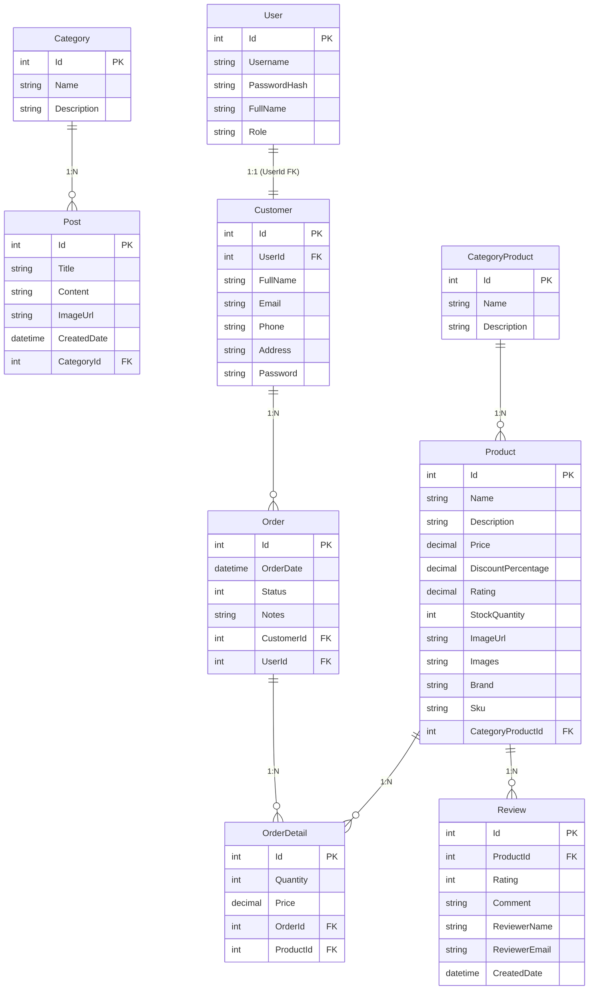

# 🗄️ Database Design & Coding Rules

> **Dự án:** Website Đồ Công Nghệ & Gaming Gear  
> **Database:** MySQL 8.0 — EF Core Code First + Pomelo Provider  
> **Sinh viên:** Phùng Đàm Duy Bảo — MSSV: 2123110487

---

## 1. Quy Tắc Thiết Kế Database (Coding Rules)

### 1.1 Quy Ước Đặt Tên

| Đối tượng        | Quy tắc                    | Ví dụ                              |
| ---------------- | -------------------------- | ---------------------------------- |
| **Bảng (Table)** | Danh từ số ít, PascalCase  | `Product`, `OrderDetail`           |
| **Cột (Column)** | PascalCase                 | `CategoryProductId`, `CreatedDate` |
| **Khóa chính**   | `Id` — int, auto-increment | `public int Id { get; set; }`      |
| **Khóa ngoại**   | `{TênBảng}Id`              | `CategoryId`, `ProductId`          |
| **DbSet**        | Danh từ số nhiều           | `DbSet<Product> Products`          |

### 1.2 Kiểu Dữ Liệu

| Loại dữ liệu   | C# Type    | MySQL Type          | Dùng cho                 |
| -------------- | ---------- | ------------------- | ------------------------ |
| Số nguyên      | `int`      | `INT`               | Id, Số lượng             |
| Tiền tệ        | `decimal`  | `DECIMAL(18,2)`     | Giá sản phẩm, Tổng tiền  |
| Chuỗi ngắn     | `string`   | `VARCHAR(255)`      | Tên, Username            |
| Chuỗi dài      | `string`   | `TEXT` / `LONGTEXT` | Mô tả, Nội dung bài viết |
| Ngày giờ       | `DateTime` | `DATETIME`          | Ngày tạo, Ngày đặt       |
| Boolean        | `bool`     | `TINYINT(1)`        | Trạng thái               |
| Chuỗi nullable | `string?`  | `VARCHAR(255) NULL` | Trường không bắt buộc    |

### 1.3 Annotation Bắt Buộc

```csharp
// ✅ LUÔN dùng Data Annotations để ràng buộc dữ liệu:

[Key]               // Khóa chính
[Required]          // Không được null
[StringLength(200)] // Giới hạn độ dài
[Range(0, double.MaxValue)]    // Giới hạn giá trị số
[Column(TypeName = "decimal(18,2)")]  // Ép kiểu chính xác
[ForeignKey("...")] // Chỉ định tên cột khóa ngoại
```

### 1.4 Quan Hệ (Relationships)

| Loại quan hệ   | C# Code                                 | Ví dụ              |
| -------------- | --------------------------------------- | ------------------ |
| **1-Nhiều**    | `public virtual T Entity { get; set; }` | `Category → Posts` |
| **Khóa ngoại** | `public int EntityId { get; set; }`     | `Post.CategoryId`  |

```csharp
// ✅ Mẫu chuẩn cho quan hệ 1-Nhiều:

// Bảng CHA (1)
public class Category
{
    public int Id { get; set; }
    public string Name { get; set; }
    // Không cần collection navigation nếu không dùng đến
}

// Bảng CON (N)
public class Post
{
    public int Id { get; set; }
    public string Title { get; set; }

    public int CategoryId { get; set; }         // Khóa ngoại
    public virtual Category Category { get; set; } // Navigation property
}
```

### 1.5 EF Core Migration Rules

```bash
# ✅ Quy trình chuẩn mỗi khi thay đổi Entity:

# 1. Tạo migration (tại thư mục duybao.data)
dotnet ef migrations add Mo_ta_thay_doi --project duybao.data --startup-project duybao.Backend

# 2. Cập nhật database
# (Tự động chạy khi khởi động app nhờ dbContext.Database.Migrate() trong Program.cs)

# 3. KHÔNG BAO GIỜ xóa migration đã được apply lên production
# 4. KHÔNG BAO GIỜ sửa file migration sau khi đã share với team
```

---

## 2. Entity Relationship Diagram (ERD)



---

## 3. Chi Tiết Từng Bảng

### 3.1 Category — Danh mục bài viết

| #   | Cột           | Kiểu           | Ràng buộc          | Mô tả          |
| --- | ------------- | -------------- | ------------------ | -------------- |
| 1   | `Id`          | `INT`          | PK, AUTO_INCREMENT | Mã danh mục    |
| 2   | `Name`        | `VARCHAR(255)` | NOT NULL           | Tên danh mục   |
| 3   | `Description` | `TEXT`         | NULL               | Mô tả danh mục |

```csharp
public class Category
{
    public int Id { get; set; }
    public string Name { get; set; }
    public string Description { get; set; }
}
```

### 3.2 Post — Bài viết / Blog

| #   | Cột           | Kiểu            | Ràng buộc               | Mô tả          |
| --- | ------------- | --------------- | ----------------------- | -------------- |
| 1   | `Id`          | `INT`           | PK, AUTO_INCREMENT      | Mã bài viết    |
| 2   | `Title`       | `VARCHAR(500)`  | NOT NULL                | Tiêu đề        |
| 3   | `Content`     | `LONGTEXT`      | NOT NULL                | Nội dung HTML  |
| 4   | `ImageUrl`    | `VARCHAR(2000)` | NULL                    | Ảnh đại diện   |
| 5   | `CreatedDate` | `DATETIME`      | NOT NULL, DEFAULT NOW() | Ngày tạo       |
| 6   | `CategoryId`  | `INT`           | FK → Category.Id        | Thuộc danh mục |

```csharp
public class Post
{
    public int Id { get; set; }
    public string Title { get; set; }
    public string Content { get; set; }
    public string ImageUrl { get; set; }
    public DateTime CreatedDate { get; set; } = DateTime.Now;
    public int CategoryId { get; set; }
    public virtual Category Category { get; set; }
}
```

### 3.3 CategoryProduct — Danh mục sản phẩm

| #   | Cột           | Kiểu           | Ràng buộc          | Mô tả           |
| --- | ------------- | -------------- | ------------------ | --------------- |
| 1   | `Id`          | `INT`          | PK, AUTO_INCREMENT | Mã danh mục SP  |
| 2   | `Name`        | `VARCHAR(255)` | NOT NULL           | Tên danh mục SP |
| 3   | `Description` | `TEXT`         | NULL               | Mô tả           |

```csharp
public class CategoryProduct
{
    [Key]
    public int Id { get; set; }
    public string Name { get; set; }
    public string Description { get; set; }
}
```

### 3.4 Product — Sản phẩm Gaming Gear

| #   | Cột                  | Kiểu            | Ràng buộc                  | Mô tả                    |
| --- | -------------------- | --------------- | -------------------------- | ------------------------ |
| 1   | `Id`                 | `INT`           | PK, AUTO_INCREMENT         | Mã sản phẩm              |
| 2   | `Name`               | `VARCHAR(200)`  | NOT NULL                   | Tên sản phẩm             |
| 3   | `Description`        | `TEXT`          | NULL                       | Mô tả chi tiết           |
| 4   | `Price`              | `DECIMAL(18,2)` | NOT NULL, ≥ 0              | Giá bán (VNĐ)            |
| 5   | `DiscountPercentage` | `DECIMAL(5,2)`  | NOT NULL, DEFAULT 0, 0-100 | % Giảm giá               |
| 6   | `Rating`             | `DECIMAL(3,2)`  | NOT NULL, DEFAULT 0, 0-5   | Đánh giá trung bình (⭐) |
| 7   | `StockQuantity`      | `INT`           | NOT NULL, ≥ 0              | Số lượng tồn kho         |
| 8   | `ImageUrl`           | `VARCHAR(2000)` | NULL                       | Ảnh sản phẩm             |
| 9   | `Brand`              | `VARCHAR(100)`  | NULL                       | Thương hiệu              |
| 10  | `Sku`                | `VARCHAR(50)`   | NULL                       | Mã SKU                   |
| 11  | `CategoryProductId`  | `INT`           | FK → CategoryProduct.Id    | Danh mục SP              |

```csharp
public class Product
{
    [Key]
    public int Id { get; set; }

    [Required(ErrorMessage = "Tên sản phẩm không được để trống")]
    [StringLength(200)]
    public string Name { get; set; }

    public string? Description { get; set; }

    [Range(0, double.MaxValue)]
    [Column(TypeName = "decimal(18,2)")]
    public decimal Price { get; set; }

    [Range(0, 100)]
    [Column(TypeName = "decimal(5,2)")]
    public decimal DiscountPercentage { get; set; } = 0;

    [Range(0, 5)]
    [Column(TypeName = "decimal(3,2)")]
    public decimal Rating { get; set; } = 0;

    public int StockQuantity { get; set; }

    public string? ImageUrl { get; set; }

    [Column(TypeName = "LONGTEXT")]
    public string? Images { get; set; }

    [StringLength(100)]
    public string? Brand { get; set; }

    [StringLength(50)]
    public string? Sku { get; set; }

    public int CategoryProductId { get; set; }

    [ForeignKey("CategoryProductId")]
    public virtual CategoryProduct? CategoryProduct { get; set; }

    public virtual ICollection<Review>? Reviews { get; set; }
}
```

### 3.4b Review — Đánh giá sản phẩm

| #   | Cột             | Kiểu            | Ràng buộc          | Mô tả                  |
| --- | --------------- | --------------- | ------------------ | ---------------------- |
| 1   | `Id`            | `INT`           | PK, AUTO_INCREMENT | Mã đánh giá            |
| 2   | `ProductId`     | `INT`           | FK → Product.Id    | Sản phẩm được đánh giá |
| 3   | `Rating`        | `INT`           | NOT NULL, 1-5      | Số sao                 |
| 4   | `Comment`       | `VARCHAR(1000)` | NULL               | Nội dung đánh giá      |
| 5   | `ReviewerName`  | `VARCHAR(100)`  | NULL               | Tên người đánh giá     |
| 6   | `ReviewerEmail` | `VARCHAR(200)`  | NULL               | Email                  |
| 7   | `CreatedDate`   | `DATETIME`      | NOT NULL           | Ngày đánh giá          |

```csharp
public class Review
{
    [Key]
    public int Id { get; set; }

    public int ProductId { get; set; }

    [ForeignKey("ProductId")]
    public virtual Product? Product { get; set; }

    [Range(1, 5)]
    public int Rating { get; set; }

    [StringLength(1000)]
    public string? Comment { get; set; }

    [StringLength(100)]
    public string? ReviewerName { get; set; }

    [StringLength(200)]
    public string? ReviewerEmail { get; set; }

    public DateTime CreatedDate { get; set; } = DateTime.UtcNow;
}
```

### 3.5 User — Người dùng hệ thống (Xác thực & Phân quyền)

> **Mục đích:** Chỉ dùng để đăng nhập và phân quyền (Admin/Editor/User).  
> **KHÔNG lưu** Email, Phone, Address ở đây — các thông tin đó thuộc về `Customer`.

| #   | Cột            | Kiểu           | Ràng buộc          | Mô tả                 |
| --- | -------------- | -------------- | ------------------ | --------------------- |
| 1   | `Id`           | `INT`          | PK, AUTO_INCREMENT | Mã người dùng         |
| 2   | `Username`     | `VARCHAR(100)` | NOT NULL, UNIQUE   | Tên đăng nhập         |
| 3   | `PasswordHash` | `VARCHAR(500)` | NOT NULL           | Mật khẩu              |
| 4   | `FullName`     | `VARCHAR(200)` | NOT NULL           | Họ tên hiển thị       |
| 5   | `Role`         | `VARCHAR(50)`  | NOT NULL           | Admin / Editor / User |

```csharp
public class User
{
    public int Id { get; set; }
    public string Username { get; set; }
    public string PasswordHash { get; set; }
    public string FullName { get; set; }
    public string Role { get; set; } // Admin, Editor, User

    // Navigation (1-1 với Customer)
    public virtual Customer? Customer { get; set; }
}
```

### 3.6 Customer — Hồ sơ khách hàng (e-Commerce)

> **Mục đích:** Lưu toàn bộ thông tin cá nhân của khách hàng để đặt hàng.  
> **Quan hệ:** 1-1 với `User` qua `UserId`.

| #   | Cột        | Kiểu           | Ràng buộc          | Mô tả                          |
| --- | ---------- | -------------- | ------------------ | ------------------------------ |
| 1   | `Id`       | `INT`          | PK, AUTO_INCREMENT | Mã khách hàng                  |
| 2   | `UserId`   | `INT`          | FK → User.Id       | Liên kết tài khoản             |
| 3   | `FullName` | `VARCHAR(200)` | NOT NULL           | Họ tên                         |
| 4   | `Email`    | `VARCHAR(200)` | NOT NULL, UNIQUE   | Email (dùng để login)          |
| 5   | `Phone`    | `VARCHAR(20)`  | NULL               | Số điện thoại                  |
| 6   | `Address`  | `TEXT`         | NULL               | Địa chỉ giao hàng              |
| 7   | `Password` | `VARCHAR(500)` | NOT NULL           | Mật khẩu (= User.PasswordHash) |

````csharp
public class Customer
{
    [Key]
    public int Id { get; set; }

    public int UserId { get; set; }

    [ForeignKey("UserId")]
    public virtual User? User { get; set; }

    [Required]
    public string FullName { get; set; }

    [Required, EmailAddress]
    public string Email { get; set; }

    public string? Phone { get; set; }
    public string? Address { get; set; }

    [Required]
    public string Password { get; set; }

    public virtual ICollection<Order>? Orders { get; set; }
}

### 3.7 Order — Đơn hàng

| #   | Cột           | Kiểu            | Ràng buộc          | Mô tả       |
| --- | ------------- | --------------- | ------------------ | ----------- |
| 1   | `Id`          | `INT`           | PK, AUTO_INCREMENT | Mã đơn hàng |
| 2   | `OrderDate`   | `DATETIME`      | NOT NULL           | Ngày đặt    |
| 3   | `TotalAmount` | `DECIMAL(18,2)` | NOT NULL           | Tổng tiền   |
| 4   | `Status`      | `VARCHAR(50)`   | NOT NULL           | Trạng thái  |
| 5   | `CustomerId`  | `INT`           | FK → Customer.Id   | Khách hàng  |

### 3.8 OrderDetail — Chi tiết đơn hàng

| #   | Cột         | Kiểu            | Ràng buộc          | Mô tả                     |
| --- | ----------- | --------------- | ------------------ | ------------------------- |
| 1   | `Id`        | `INT`           | PK, AUTO_INCREMENT | Mã chi tiết               |
| 2   | `Quantity`  | `INT`           | NOT NULL, > 0      | Số lượng                  |
| 3   | `Price`     | `DECIMAL(18,2)` | NOT NULL           | Đơn giá tại thời điểm đặt |
| 4   | `OrderId`   | `INT`           | FK → Order.Id      | Thuộc đơn hàng            |
| 5   | `ProductId` | `INT`           | FK → Product.Id    | Sản phẩm                  |

---

## 4. Dữ Liệu Mẫu (Seed Data)

> Khai báo trong `ApplicationDbContext.OnModelCreating()` bằng `modelBuilder.Entity<T>().HasData(...)`

### 4.1 Danh Mục Sản Phẩm — Gaming Gear

```csharp
modelBuilder.Entity<CategoryProduct>().HasData(
    new CategoryProduct { Id = 1, Name = "🖱️ Chuột Gaming",       Description = "Chuột chơi game chuyên dụng, cảm biến cao cấp" },
    new CategoryProduct { Id = 2, Name = "⌨️ Bàn Phím Cơ",        Description = "Bàn phím cơ switch hotswap, custom keycap" },
    new CategoryProduct { Id = 3, Name = "🎧 Tai Nghe Gaming",    Description = "Tai nghe 7.1 surround, noise-cancelling" },
    new CategoryProduct { Id = 4, Name = "🪫 Lót Chuột LED",      Description = "Mousepad RGB kích thước lớn, chống trượt" }
);
````

### 4.2 Danh Mục Bài Viết

```csharp
modelBuilder.Entity<Category>().HasData(
    new Category { Id = 1, Name = "🛠️ Hướng Dẫn Custom",   Description = "Hướng dẫn mod, build bàn phím cơ, thay switch" },
    new Category { Id = 2, Name = "🏆 Top List & Review",   Description = "Bảng xếp hạng, đánh giá sản phẩm gaming" },
    new Category { Id = 3, Name = "📰 Tin Công Nghệ",       Description = "Tin tức mới nhất về gaming gear" },
    new Category { Id = 4, Name = "💡 Mẹo & Thủ Thuật",     Description = "Mẹo tối ưu setup gaming, bảo trì thiết bị" }
);
```

### 4.3 Bài Viết Mẫu

```csharp
modelBuilder.Entity<Post>().HasData(
    new Post { Id = 1, Title = "Hướng dẫn custom bàn phím cơ cho người mới",
               Content = "Bài viết hướng dẫn chi tiết...",
               ImageUrl = "https://placehold.co/600x350/1a1a2e/eee?text=Custom+Keyboard",
               CategoryId = 1, CreatedDate = new DateTime(2026, 6, 15) },
    new Post { Id = 2, Title = "Top 5 chuột gaming dưới 1 triệu đáng mua nhất 2026",
               Content = "Bảng xếp hạng chi tiết...",
               ImageUrl = "https://placehold.co/600x350/16213e/eee?text=Gaming+Mouse+Top5",
               CategoryId = 2, CreatedDate = new DateTime(2026, 6, 12) },
    new Post { Id = 3, Title = "Review tai nghe HyperX Cloud II sau 1 năm sử dụng",
               Content = "Đánh giá chi tiết...",
               ImageUrl = "https://placehold.co/600x350/0f3460/eee?text=HyperX+Review",
               CategoryId = 2, CreatedDate = new DateTime(2026, 6, 10) },
    new Post { Id = 4, Title = "5 mẹo bảo trì bàn phím cơ giúp kéo dài tuổi thọ",
               Content = "Mẹo vệ sinh...",
               ImageUrl = "https://placehold.co/600x350/533483/eee?text=Maintenance+Tips",
               CategoryId = 4, CreatedDate = new DateTime(2026, 6, 8) },
    new Post { Id = 5, Title = "Switch bàn phím cơ: Linear vs Tactile vs Clicky - Nên chọn loại nào?",
               Content = "So sánh chi tiết...",
               ImageUrl = "https://placehold.co/600x350/e94560/eee?text=Switch+Guide",
               CategoryId = 1, CreatedDate = new DateTime(2026, 6, 5) }
);
```

---

## 5. Best Practices

### 5.1 ✅ NÊN LÀM

- **Dùng `async/await`** khi truy vấn database để không block thread
- **Include navigation property** khi cần dữ liệu liên quan: `.Include(p => p.Category)`
- **Validate dữ liệu** bằng Data Annotations `[Required]`, `[Range]`
- **Seed data** cho danh mục và tài khoản mẫu trong `OnModelCreating`
- **Dùng `dotnet ef migrations add`** cho mọi thay đổi schema

### 5.2 ❌ KHÔNG NÊN LÀM

- **Không** dùng `SELECT *` trong raw SQL — luôn dùng LINQ
- **Không** lưu password plain text — dùng hash (BCrypt hoặc ASP.NET Identity)
- **Không** sửa trực tiếp file migration sau khi đã share
- **Không** gọi `SaveChanges()` trong vòng lặp — dùng batch
- **Không** hardcode connection string — luôn đọc từ `appsettings.json`

### 5.3 Connection String Mẫu

```json
// appsettings.json
{
  "ConnectionStrings": {
    "DefaultConnection": "Server=localhost;Port=3306;Database=duybao_gaming;User=root;Password=your_password;Charset=utf8mb4;"
  }
}
```

---

> **Trạng thái:** Hoàn thiện — Áp dụng cho toàn bộ dự án.
